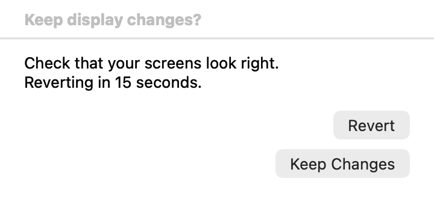
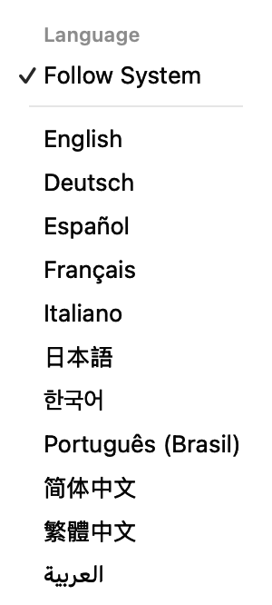
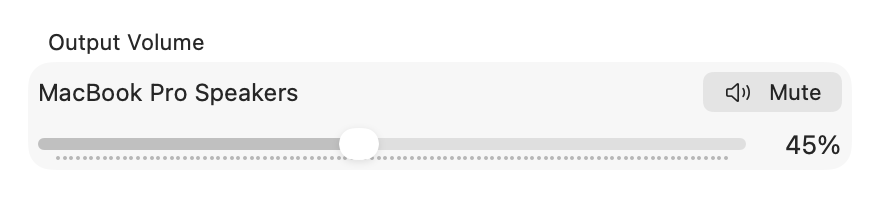
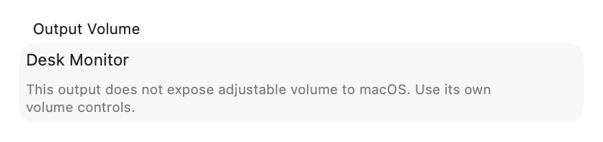
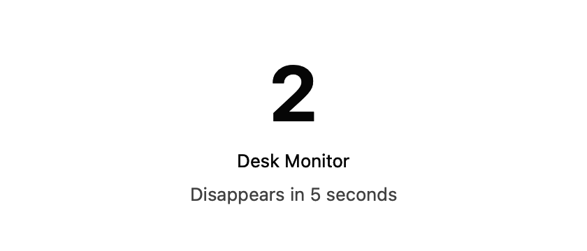
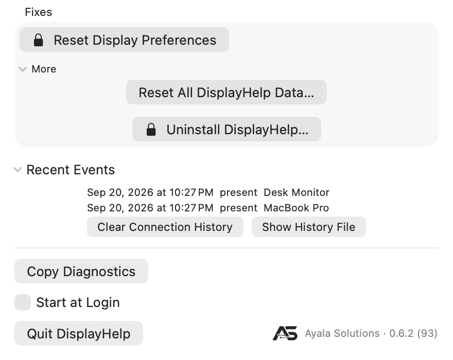

# DisplayHelp

DisplayHelp is a menu bar app for macOS that makes projectors, TVs and external displays behave. Plug in, answer one question, and it remembers the room. Built by Ayala Solutions for school helpdesks and for anyone who connects a Mac to a different screen every day.

Latest release **0.6.7 (122)** • macOS 14 Sonoma or later • Apple Silicon and Intel • Proprietary, not open source

Feedback, bug reports and suggestions are welcome.

[DisplayHelp — The Complete Guide](https://www.youtube.com/watch?v=03BKYc1qiVc) covers the earlier interface in 17 minutes, with chapters for install, Mirror and Extend, profiles, fixes and troubleshooting.

### Downloads

- [Signed and notarized installer](https://github.com/hov172/DisplayHelp/releases/download/v0.6.7/DisplayHelp-0.6.7.pkg)
- [Public guide — Word](https://github.com/hov172/DisplayHelp/releases/download/v0.6.7/DisplayHelp-0.6.7-User-Guide.docx)
- [Public guide — PDF](https://github.com/hov172/DisplayHelp/releases/download/v0.6.7/DisplayHelp-0.6.7-User-Guide.pdf)
- [Custom Fixes examples and installation README](https://github.com/hov172/DisplayHelp/releases/download/v0.6.7/DisplayHelp-0.6.7-Custom-Fixes.zip)
- [Current UI screenshots](https://github.com/hov172/DisplayHelp/releases/download/v0.6.7/DisplayHelp-0.6.7-Screenshots.zip)
- [SHA-256 checksums](https://github.com/hov172/DisplayHelp/releases/download/v0.6.7/SHA256SUMS.txt)

Version 0.6.7 shows the HDCP state macOS reports at the end of each external display’s status line, adds **Check HDCP** with repeater and topology details on DisplayPort connections, includes those readings in Copy Diagnostics, offers a one-click smoother refresh rate when a display runs below 50 Hz, and fixes brightness, contrast and monitor volume on macOS 26. DisplayHelp only reads HDCP state; it never changes or negotiates protection.

Version 0.6.6 adds system-wide favorite shortcuts, simpler Quick Switch Profiles, Restore Previous/Default Setup, and safer profile matching for identical monitors. Profile and language controls remain stable during background status reads.

Version 0.6.5 added ten languages alongside English, a globe menu for an app-only language choice, layouts that adapt to longer translations, and confirmations that stay above the app. **Follow System** uses macOS language preferences and bundled translations; macOS does not generate translations. Profiles remain language-independent. Apple terminology has been checked for the latest four languages; independent native-speaker review remains pending.

Supported languages: English, German, Spanish, French, Italian, Japanese, Korean, Brazilian Portuguese, Simplified Chinese, Traditional Chinese and Arabic. [Languages and how to switch](#languages-and-how-to-switch).

Version 0.6.1 added Forget This Display, a backed-up Reset All DisplayHelp Data action, and Turn Off All Automatic Profiles. It fixes upgrades leaving the old app running and makes the menu taller, up to 900 points within the available screen height. Longer menus scroll.

Version 0.6.0 adds a compact screen layout, two favorite profile slots, full and layout-only profiles, aligned screen placement, and a single 20-second Keep/Revert window. Display changes are verified before they are remembered. Existing profiles remain compatible.

<p align="center">
  <a href="docs/images/menu-viewport.png"></a>
</p>

The new UI screenshots use sample display data rendered by the production views. The screen diagram reflects display geometry; it does not capture or stream desktop content. The menu captures show DisplayHelp 0.6.7 (122), captured on 2026-09-25 with isolated sample data; other captures are from 0.6.6 and show controls that are unchanged in 0.6.7. [Screenshot details](docs/README.md#screenshots).

**Identify Displays** beneath the layout shows matching numbers and names on connected screens for five seconds. Mirrored screens share a numbered group. The labels do not change settings or block clicks.

<p align="center">
  <a href="docs/images/keep-changes.png"></a>
</p>

- macOS 14 Sonoma or later, Apple Silicon and Intel.

- One menu bar icon, no main window and no account. Settings stay on your Mac; profile sharing is your choice.

- Installs with a signed and notarized installer, starts at login and can uninstall itself.

## Contents

- [Watch the guide](#watch-the-guide)
- [Why it exists](#why-it-exists)
- [Install](#install)
- [Languages and how to switch](#languages-and-how-to-switch)
- [First plug-in](#first-plug-in)
- [The menu at a glance](#the-menu-at-a-glance)
- [Everyday use](#everyday-use)
- [Output Volume](#output-volume)
- [Identify your screens](#identify-your-screens)
- [Choose and save the main screen](#choose-and-save-the-main-screen)
- [Profiles: one name per room](#profiles-one-name-per-room)
- [Clear history, forget a display, or start fresh](#clear-history-forget-a-display-or-start-fresh)
- [Fixes](#fixes)
- [Custom Fixes setup](#custom-fixes-install-and-use-your-own-actions)
- [When something still looks off](#when-something-still-looks-off)
- [Where it keeps things](#where-it-keeps-things)
- [Privacy](#privacy)
- [Helpdesk deployment](#helpdesk-deployment)
- [Example custom scripts](#example-custom-scripts)

## Why it exists

Every teacher has lived this. The projector shows a stretched picture. The Dock is half off the screen. The text is tiny. The laptop shows a black band. The TV shows snow. macOS can fix all of it if you know which of four panes to open, but the person at the front of the room has thirty seconds and a class waiting.

DisplayHelp puts the handful of things that actually fix these problems in one menu, applies them automatically once it has seen a display, and keeps a log so the helpdesk can see what happened when someone calls. It was built against real hardware, and every default in it came from a problem that showed up on a real TV or projector.

| Problem | What DisplayHelp does |
|---|---|
| Wrong resolution after plugging in | Remembers the right one per display and re-applies it on every reconnect |
| Dock half cut off | Restarts the Dock after the display settles |
| Snow on a TV | Filters sizes using the display’s supported-size information when available |
| Tiny UI on a 4K TV | Prefers readable HiDPI scaling when a suitable mode is available |
| Laptop and TV on different sizes | Keeps a mirror set on one logical size in both directions |
| Different rooms, different needs | Named profiles that capture every connected display |
| "It just keeps coming up wrong" | One-click reset of macOS's display database |

## Install

- Get the latest signed and notarized DisplayHelp installer from Ayala Solutions or your organization’s helpdesk. Open it and follow the installation prompts. The app installs in Applications and starts automatically.

- Look for the display icon in the menu bar. That is the whole app.

- Start at Login is on by default, so it is there tomorrow.

For organization-wide installation, ask your IT team to deploy the installer through its Mac management service and test it in representative rooms first.

### Check your installed version

<p align="center">
  <a href="docs/images/about.png"></a>
</p>

Use About when your helpdesk asks which version you have.

1. Open the DisplayHelp menu and click **Ayala Solutions · ‹version›** at the bottom right.

2. Read the version shown in the About window and include it with a support request.

3. Close the About window to return to your work.

Shown: the 0.6.6 About panel; 0.6.7 reads 0.6.7 (122). Use the version displayed on your own Mac when reporting an issue.

## Languages and how to switch

**New in 0.6.5: ten additional languages, for eleven supported languages including English.**

| Language | Name shown in the globe menu |
|---|---|
| English | English |
| German | Deutsch |
| Spanish | Español |
| French | Français |
| Italian | Italiano |
| Japanese | 日本語 |
| Korean | 한국어 |
| Brazilian Portuguese | Português (Brasil) |
| Simplified Chinese | 简体中文 |
| Traditional Chinese | 繁體中文 |
| Arabic | العربية |

### Follow your Mac's language

DisplayHelp follows macOS language preferences by default. If you previously chose an app language, open DisplayHelp, click the **globe** at the top, choose **Follow System**, then **Restart Now**. macOS selects the best available bundled translation from your preferred languages; English is the final fallback.

For example, a Mac set to Italian uses Italian when DisplayHelp follows the system. An unsupported first language can fall back to another supported language in your preferred list.

### Choose a language inside DisplayHelp

1. Click the DisplayHelp icon in the macOS menu bar.
2. Click the **globe** at the top of the app menu.
3. Select your language by its native name.
4. Choose **Restart Now**, or **Later** to apply the choice the next time the app opens.

This changes only DisplayHelp for the current macOS user. For example, you can use DisplayHelp in Spanish on an English-language shared Mac without changing the Mac's language or other apps. The selection persists until changed; choose **Follow System** to return to the Mac's preferences. The globe is temporarily unavailable while display changes, profile checks or fixes are running.

<p align="center">
  <a href="docs/images/language-menu.png"></a>
</p>

### macOS settings versus the in-app globe

| Where you choose | What it does |
|---|---|
| **System Settings → General → Language & Region → Preferred Languages** | Sets the Mac's language preferences, which DisplayHelp follows when it has no app-specific override. |
| **System Settings → General → Language & Region → Applications → DisplayHelp** | Sets a language specifically for DisplayHelp. Relaunch the app to apply it. |
| **DisplayHelp → globe → a language** | Sets the same native per-app language preference from inside the app, with a restart prompt. |
| **DisplayHelp → globe → Follow System** | Removes the app-specific override so macOS chooses from your preferred languages again. |

**Both routes use Apple's native localization system and the same bundled translations.** The globe is a convenient selector, not a separate translation engine. An app-specific choice takes precedence over the Mac's preferred languages until removed. No online translation service is used, and macOS does not generate missing translations.

Language is separate from display profiles: loading or importing a profile does not change it. User-entered profile/display names, device names, custom script descriptions/output and historical diagnostics keep their original text. Longer interface labels wrap or stack; Arabic uses right-to-left presentation while the display diagram preserves physical screen positions.

## First plug-in

The first time a display is connected, a small dialog asks one question:

- Mirror for teaching. Both screens show the same thing.

- Extend for working. The other screen becomes a second desktop.

- Not now leaves macOS's default and asks again next time.

Choose Mirror or Extend and DisplayHelp remembers the choice for this display on this Mac. Choosing Not now leaves the decision for a later connection. Display identity depends on its manufacturer, model and serial information. Settings do not sync between Macs; use profile export and import to transfer a setup and map its devices.

### Choose what happens on connection

<p align="center">
  <a href="docs/images/first-connect.png"></a>
</p>

This prompt appears when DisplayHelp needs an arrangement choice for an external display.

1. Connect the display and wait for the prompt.

2. Choose Mirror to show the same desktop to an audience, or Extend to gain a separate desktop.

3. Choose Not now to keep the current macOS arrangement and decide on a later connection.

Mirror or Extend is remembered for this display on this Mac.

## The menu at a glance

Click the icon. Top to bottom:

| Row | What it is |
|---|---|
| Profile, Displays heading, globe | Save, preview, restore, update, remove, import and export named setups; the globe at the right end chooses an app language or Follow System (restart to apply). |
| Quick Switch Profiles | Favorite 1 (⌘⌥1) and Favorite 2 (⌘⌥2) slots, Save Current Setup as Default, and the Restore Previous Setup / Restore Default Setup buttons. |
| Screen Layout | Numbered geometry preview with Identify Displays in its header. |
| Output Volume | Live volume and mute for the active macOS audio output, when supported. |
| Display cards | Common controls, the HDCP state at the end of the status line, plus observed placement, alignment and rotation beside Place…. Expand More Controls for refresh rate, recommendations, audio, rotation, Check HDCP and the rest. |
| Troubleshooting | Detect Displays (applies recommendations), fixes, Recent Events with Show History File, and Copy Diagnostics. Reset All DisplayHelp Data and Uninstall are under More. |
| Start at Login, Quit DisplayHelp, Ayala Solutions · version | Footer; the version button opens About. |

The menu bar icon itself shows state: stacked rectangles when mirrored, two displays when extended, one when the laptop is alone.

Each card’s status line starts with an icon. A green check means the display is on a mode the app would choose. A grey ⓘ means a different mode is recommended or the external display is running below 50 Hz; when a faster rate exists at the same size, an orange one-click hint appears under the line. Try Match Laptop or Best for Display when available. A green mirrored laptop does not mean the TV is running at the same refresh rate.

### Find the control you need

<p align="center">
  <a href="docs/images/menu.png"></a>
</p>

The main menu groups settings into a card for each connected display.

1. Click the DisplayHelp icon in the menu bar.

2. Find the card named for the display you want to change.

3. Check its arrangement, resolution and refresh rate before choosing a control.

Shown: sample displays in the 0.6.7 interface, with the HDCP state at the end of the external status line. The card reports each display’s own mode and refresh rate. A grey ⓘ means a different mode is recommended; it does not prove a faster mode is available on your connection.

## Everyday use

### "The picture is wrong, fix it"

Open **Troubleshooting → Detect Displays** to rescan and apply the app’s display recommendations. It can adjust resolution, refresh rate and which display leads mirroring, including correcting an unsuitable built-in display mode. Use it when you want those changes applied rather than keeping a manually selected setup.

### Mirror or Extend

Two buttons on each external display's card. The one you are on is greyed. The choice is remembered.

### Switch to separate desktops

<p align="center">
  <a href="docs/images/extend.png"></a>
</p>

Use Extend when you want different windows on the laptop and external screen.

1. Find the external display’s card and choose Extend.

2. Move a window between the screens to confirm that they act as separate desktops.

3. Use Place… to match their physical placement, or choose Mirror to return to a shared desktop.

Place… appears beside the current placement and rotation when displays are extended; Make Main is inside that menu.

### Resolution and Refresh Rate

Resolution lists available sizes and scaling options, using the highest offered refresh rate for each. When the display supplies supported-size information, DisplayHelp uses it to filter the list; otherwise it uses the modes macOS offers. The current size stays listed. Available modes depend on the display, adapter, cable and connection.

### Choose a resolution

<p align="center">
  <a href="docs/images/resolution.png"></a>
</p>

Use Resolution to change desktop size or make text easier to read.

1. Open Resolution on the correct display card.

2. Choose an offered size. Use a suitable HiDPI option when available for readable, sharp text.

3. Check the picture and the status line after the setting changes.

The screenshot uses sample available modes. A listed rate is the highest offered for that size; check the status line for the rate actually in use.

Refresh Rate appears under **More Controls** when the current size offers more than one rate. Choose a rate supported by the entire connection. Higher rates generally make motion smoother; a lower rate may work better on a limited connection. The status line shows the rate actually in use.

### Choose a refresh rate

<p align="center">
  <a href="docs/images/refresh-rate.png"></a>
</p>

Use Refresh Rate to select a different available rate for the current size.

1. Choose the resolution you intend to use.

2. Open **More Controls**, then Refresh Rate, and select one of the offered rates.

3. Check that the picture is stable and confirm the new rate in the status line.

The control appears only when multiple rates are available. The sample rates shown are illustrative; your connection may offer different rates.

### Match Laptop and Best for Display

Both buttons are under **More Controls** on an external display's card.

- Match Laptop tries to match the laptop’s logical desktop size, then uses a suitable alternative when that size is unavailable.

- Best for Display prefers a suitable native-resolution mode with readable scaling when available, such as 1920×1080 HiDPI on a 4K TV. Recommendations prefer 50 Hz or better, but can fall back to a lower rate when the available modes require it.

A recommendation button is greyed out when it would not change the current mode or no suitable candidate is available. The status icon can remain the grey ⓘ at a low refresh rate. Mirroring keeps both displays on a shared logical desktop size; their reported refresh rates can differ.

### Laptop Leads Mirror

Off by default: the TV's shape wins, both share one size, and a 16:10 laptop shows a thin band top and bottom on a 16:9 screen. On: the laptop is full-screen and the TV shows side bars. Use it when you are working on the laptop and the audience screen is secondary. Remembered per display.

### Audio

Open **More Controls** on an external display’s card. Choosing Audio switches the active output and remembers that display’s reconnect preference.

Pick which output plays the Mac's sound whenever this display is connected: the TV's own HDMI audio, the 3.5 mm cable to the room amp, a USB dock, an AirPlay receiver, or a presentation gateway's driver. "Don't change" is the default, so plugging in to charge never hijacks a call. Remembered per display and carried in profiles.

### Choose where sound plays

<p align="center">
  <a href="docs/images/audio.png"></a>
</p>

Use Audio to remember a sound output for this connected display.

1. Open **More Controls → Audio** on the external display’s card.

2. Select the TV, speakers, dock or other output you want to use.

3. Play a short sound and check that it comes from the intended device.

Don’t change leaves audio routing alone when this display connects. Available outputs depend on the connected devices.

### Output Volume

The **Output Volume** section beneath Screen Layout follows the active macOS audio device. Select **MacBook Pro Speakers** in macOS Sound or in a display’s Audio picker to control built-in speaker volume. Changes made with the volume keys, Control Center or another app update the control automatically while DisplayHelp is running.

<p align="center">
  <a href="docs/images/output-volume.png"></a>
</p>

Use the slider or **Mute / Unmute** when available. Some outputs, commonly HDMI, do not expose adjustable software volume to macOS. Use their physical controls, or **Monitor Volume** when the monitor supports DDC/CI.

<p align="center">
  <a href="docs/images/output-volume-unavailable.png"></a>
</p>

Output Volume and mute are live system controls and are **not saved in profiles**. The separately labeled **Monitor Volume** slider controls an external monitor through DDC/CI and keeps its existing profile behavior. Changing the active output during an adjustment prevents the old control from writing to the newly selected device.

### Rotation, Underscan, Brightness, Contrast, Monitor Volume

Controls appear only when the display, connection and available readings support them. Rotation suits portrait screens; underscan can help when edges are cut off. Built-in brightness is available when it can be read. External brightness, contrast and volume depend on display-control support and may be unavailable on a TV, adapter or port.

### Rotate a display

<p align="center">
  <a href="docs/images/rotation.png"></a>
</p>

Use Rotation for a screen mounted in portrait orientation or another supported position.

1. Find the intended external display’s card, open **More Controls**, then Rotation. The built-in display has no Rotation row.

2. Choose the angle that matches the screen’s physical orientation.

3. Check the result. Choose 0° to return to the normal orientation.

Opening the menu alone makes no change. Rotation and the other controls in this section depend on hardware support.

### Identify your screens

Click **Identify Displays** beneath Screen Layout. Large numbers and display names appear for five seconds, matching the preview. Extended screens get separate labels; mirrored screens share a group such as **1 + 2**. The labels do not change settings, steal focus or block clicks. Clicking again restarts the timer.

<p align="center">
  <a href="docs/images/identify-displays.png"></a>
</p>

### Choose and save the main screen

1. Use **Extend** mode and find the desired display’s card. Use **Identify Displays** if needed.
2. Open **Place… → Make [display name] Main**, then **Keep Changes**. The preview marks it **Main**.
3. Save a new profile, or choose **Profile → Overwrite with Current Settings → [profile name]**.

Both **Full setup** and **Layout only** profiles save the main-screen choice. Existing profiles change only when you save or overwrite them.

### Position

Each card shows its detected side and alignment relative to a named screen, plus rotation. Nonstandard arrangements show **Custom position**; mirrored and single displays show their arrangement instead. These readouts reflect the current setup, including changes made outside the app or reverted changes.

In Extend mode: **Place… → Make [display name] Main** moves the menu bar to that display. Place… puts it left, right, above or below another, with top/center/bottom alignment for side-by-side displays or left/center/right alignment for stacked displays. The numbered layout preview shows relative sizes, positions, rotation and the main display. The Place menu is hidden while mirrored, where independent position has no meaning; the arrangement and rotation readouts remain visible.

### Arrange extended displays

<p align="center">
  <a href="docs/images/position.png"></a>
</p>

Use Place… when the pointer moves between screens in the wrong direction.

1. Choose Extend if the displays are currently mirrored.

2. Open Place… on the display you want to position, then choose its direction relative to another screen and select an edge or center alignment.

3. Move the pointer across the shared edge to test the layout. Use Make Main if that display should hold the main desktop.

For example, on the external screen’s card choose **Place… → Relative to Built-in Display → Place [external name] left of Built-in Display**, then an alignment. Choosing Left on the built-in card instead puts the laptop to the left of the external screen.

### Rename

Use the pencil next to an external display’s name, type a room name and press Return. The nickname is stored for this user on this Mac. It is not transferred by profile import. Renaming cannot distinguish two displays that report the same identity.

<p align="center">
  <a href="docs/images/rename.png"></a>
</p>

Rename is active in this screenshot: the external display’s name is editable at the top of its card. Replace it with a room name, then press Return to save or Escape to cancel. The normal display icon and status return when editing ends.

### Inspect display details

<p align="center">
  <a href="docs/images/display-details.png"></a>
</p>

Use the information popover when checking capabilities or reporting a problem.

1. Click the information button on the display’s card.

2. Review the current mode, native size and supported resolutions.

3. Give your helpdesk the relevant values, then click away to close the popover.

This view reports information; it does not apply a setting. The values shown come from an isolated sample display.

## Profiles: one name per room

Rooms differ. The same laptop mirrors to a 4K TV in 204, extends to a portrait screen in the library, and needs the laptop full-screen at the podium. Save each as a profile:

### Open the Profile menu

<p align="center">
  <a href="docs/images/profiles.png"></a>
</p>

A profile is a named snapshot of a setup. Choose **Full setup** to include readable picture controls and audio, or **Layout only** to save resolution, refresh rate, rotation, position, mirroring and the main display without changing brightness, contrast, volume, underscan or audio.

**Quick Switch Profiles** contains two global favorite slots. They stay assigned when you change the active profile, so you can switch back to another setup. A favorite does not indicate which profile is currently applied; the **Profile** row shows that.

**Going back after a switch:** choose **Restore Previous Setup** below **Quick Switch Profiles** to preview the setup from before the last successful profile switch. To keep a permanent starting point, arrange your displays once, expand **Quick Switch Profiles**, and choose **Save Current Setup as Default…**, then **Save**. Later, use **Restore Default Setup**. Both restores use the usual preview and Keep/Revert checks, and both saved setups survive app restarts. Default changes only when you explicitly save it again; it is not a factory reset or a reconstruction of an earlier first connection. See [Previous and Default Setup](docs/user-guide.md#previous-and-default-setup-066).

For two templates, arrange your screens and save the first profile, then change the settings and save the second. Expand **Quick Switch Profiles** beneath Profile to see **Favorite 1 (⌘⌥1)** and **Favorite 2 (⌘⌥2)** (since 0.6.6). The app remembers whether this section is expanded; both restore buttons remain visible when it is collapsed:

1. Next to **Favorite 1**, click **Choose Profile…** and select a saved profile. Assignment does not change your displays.
2. Repeat beside **Favorite 2** for the other profile.
3. Click **Preview** next to either slot to review its settings, then choose **Apply** and **Keep Changes**.

To replace or remove a favorite, click its assigned profile name and choose another profile or **Remove Favorite**. If no profiles exist, choose **Save Current Setup As…** from the slot menu, save a profile, then select it in the slot.

In 0.6.6, **⌘⌥1** and **⌘⌥2** open the same preview from any app when the keys are released, while DisplayHelp is running. No Accessibility or Input Monitoring permission is needed. Only assigned favorites reserve a shortcut; removing the favorite releases it. If registration fails, an explanation appears below the affected slot; use **Preview** or the local shortcut while DisplayHelp is active. Overwriting a profile preserves its scope and favorite slot. Imported profiles start without favorite assignments. Version 0.6.5 uses the nested **Profile → Favorite Shortcuts** menu and app-local shortcuts.

For a four-display desk, each extended display can have its own resolution in each profile, within the capabilities of your Mac and connections. Version 0.6.6 can save identical reported hardware identities when macOS provides distinct display UUIDs. The restore preview numbers those screens; check them before applying. After swapping cables or ports, save the setup again. These profiles require manual preview and cannot load automatically. If macOS cannot distinguish the displays, saving remains blocked. Separate nicknames, reconnect preferences and ambiguous DDC controls remain unavailable.

**Using identical monitors?** Follow the [limitations and cable/port-change workaround](docs/user-guide.md#identical-monitors-limits-and-workaround-066). Set up the intended layout first, then overwrite each affected profile; do not apply an old profile to establish the new mapping.

1. Open Profile at the top of the menu.

2. Choose a saved name to preview it, or Save Current Setup As… to create a new one.

3. Use Overwrite or Remove only for the profile you intend to replace or delete.

Choosing a saved name opens a preview first. Review it before applying changes.

- Set everything the way you want it on every connected display.

- Profile › Save Current Setup As…, type the room, press Save.

- Next time, choose Profile › Room 204, review the preview and choose Apply. DisplayHelp restores the available saved settings and checks the result. Cancel closes the preview without applying changes.

### Save the current setup

<p align="center">
  <a href="docs/images/save-profile.png"></a>
</p>

Use a separate profile for each room or arrangement you want to recall.

1. Connect all displays and set the layout, picture and audio as desired.

2. Choose Profile › Save Current Setup As… and type a recognizable name.

3. Choose Save. Use Cancel if you do not want to create the profile.

Shown: the current name and scope fields with sample profile data. Saving captures the current setup; it is not a request to change the displays.

The menu's title is the profile the displays are on right now. Change something by hand and it drops back to "Choose or Create…" because the profile no longer describes what is on screen. Overwrite with Current Settings › Room 204 replaces a profile with what is on screen now; Update "Room 204" with Current Settings is the shortcut for the one you last used. Remove deletes one.

A profile captures arrangement, size, refresh rate, readable brightness/contrast/monitor volume, rotation, underscan, mirror leadership, display positions, the main display, per-display audio preferences, and the active system audio output. Restoration waits for pending changes and reports any settings that could not be restored or verified. The profile name appears only when all saved settings and connected displays match; status refreshes while the menu is open.

Older profiles still load. Re-save them to capture settings that older versions did not store. Saved per-display choices are used when reconnecting unless the connected hardware identities are ambiguous; a full profile restore also restores the saved layout and system audio. Displays outside the profile receive no saved settings, although macOS may reposition them when the main display changes. Identical hardware identities require distinct macOS UUIDs to save a profile in 0.6.6; an old ambiguous profile is never guessed onto a screen.

### Preview, automatic loading and sharing

Selecting a profile opens a read-only preview of current → saved values, missing displays and unavailable audio or modes. Choose Apply, Apply to Connected Displays, or Cancel. Hardware readback verifies the result.

Manual profile restores and changes to resolution, rotation, underscan, mirroring, position or the main display open a separate **Keep Changes / Revert** window. You have 20 seconds to keep the change; otherwise DisplayHelp restores the previous setup. Closing the menu does not dismiss the recovery window. Quitting normally during confirmation restores the previous setup before exiting. Keep performs another hardware check before saving reconnect preferences. A failed restore rolls back, including automatic profile restores; unavailable or disconnected hardware can prevent complete recovery, and the app reports any settings it could not restore. The timed recovery requires DisplayHelp to remain running; force-quitting or a crash stops it.

### Preview and restore a profile

<p align="center">
  <a href="docs/images/restore-preview.png"></a>
</p>

The preview shows the differences between the current setup and the saved one.

1. Choose the saved profile from the Profile menu.

2. Review the proposed changes and any missing-device or unavailable-setting messages.

3. Choose Apply, or Apply to Connected Displays when offered. Choose Cancel to make no changes.

4. Check the restore result for settings that could not be restored or verified.

Shown: a sample profile’s current-to-saved comparison. The dialog was dismissed without applying settings.

Profile › Load Automatically When Connected opts a profile into loading when its exact display set connects or at app launch. Automatic loading waits for connection changes to settle and runs once for that connection set; manually changing a resolution does not reload it. Conflicting automatic matches are not applied. Uncheck a profile to disable its automatic loading, or choose **Turn Off All Automatic Profiles** to make every profile manual.

### Enable automatic profile loading

<p align="center">
  <a href="docs/images/automatic-profile.png"></a>
</p>

Use this when a known combination of displays should load the same setup on connection.

1. Save and test the profile with all intended displays connected.

2. Open Profile › Load Automatically When Connected and select the intended profile.

3. On the next connection of that exact display set, confirm the expected setup and check any restore result.

Automatic loading requires an exact, unambiguous match. Imported profiles start with it disabled; conflicting matches are not applied. Profiles that use macOS UUIDs to distinguish identical hardware identities require manual preview and cannot load automatically.

Profile › Export… shares one or all saved profiles. Import Profiles… lets you map saved displays and audio outputs to devices on this Mac. Existing profiles are kept, duplicate names receive numbered suffixes, and imported profiles start with automatic loading disabled. Importing does not apply the setup. Review its preview before applying, and enable automatic loading only when wanted. Profiles with unmapped devices can be kept for later.

### Import a shared profile

<p align="center">
  <a href="docs/images/import-mapping.png"></a>
</p>

Use Import Profiles… to bring a saved setup from another Mac into this one.

1. On the original Mac, choose Profile › Export… and share the exported profile with the intended recipient.

2. On this Mac, choose Profile › Import Profiles… and select the exported profile.

3. Review the display and audio mappings. Choose Import when ready.

4. Open the imported profile’s preview before applying it.

The dialog uses sample profile data. Existing profiles are preserved, duplicate names receive numbered suffixes, and automatic loading starts disabled.

### Choose the matching display

<p align="center">
  <a href="docs/images/import-display-choices.png"></a>
</p>

Use each display selector to map the saved device to its counterpart on this Mac.

1. Open the selector below the saved display’s name.

2. Choose the connected display that should receive those saved settings.

3. If that device is absent, keep its saved identity for later. Review the other mappings before importing.

Sample data: saved laptop and monitor identities are mapped to the current fixture displays. Do not map two different saved displays to the same destination.

## Clear history, forget a display, or start fresh

<p align="center">
  <a href="docs/images/data-actions.png"></a>
</p>


| What you want | Action | What is kept |
|---|---|---|
| Clear the activity list | **Troubleshooting → Recent Events → Clear Connection History** | Saved profiles, favorites and remembered monitor settings; the old log is archived |
| Ask again when one monitor reconnects | Its **… → Forget This Display…** menu | Saved profiles, favorites, history and the current screen setup |
| Reset all remembered app data | **Troubleshooting → More → Reset All DisplayHelp Data…** | A backup of the old data, custom fixes, Start at Login and the current screen setup |

**Automatic profile loading is optional.** Under **Profile → Load Automatically When Connected**, uncheck
individual profiles or choose **Turn Off All Automatic Profiles**. Profiles stay available for manual use.
Forgetting a display does not edit saved profiles: an enabled automatic profile can restore it on reconnect
or app launch. Disable those profiles if you want DisplayHelp to ask again.

To forget a connected external display, open its **…** menu and choose **Forget This Display…**. Review the
confirmation, then choose **Forget This Display**. This removes both its current and older identity-based
preferences. If two connected displays share the same identity, DisplayHelp refuses to forget just one.

The full reset is separate and requires **Back Up and Reset** confirmation. It removes the active remembered
displays, profiles/favorites, automatic choices and history. **Show Data Backup in Finder** reveals the preserved
`DisplayHelp-backup-<UUID>` folder next to the app's data folder. This is not secure erasure: the old information
remains in the backup, and separately exported profiles are untouched. See the [complete reset and restore
instructions](docs/user-guide.md#clear-history-forget-a-display-or-start-fresh).

## Fixes

Expand **Troubleshooting** to reach Detect Displays, fixes, Recent Events and Copy Diagnostics.

- Reset Display Preferences clears macOS’s saved display configuration and restarts the display session. Everyone using the Mac is logged out, so save work first. Use it when display problems persist after trying the ordinary controls. It requires an administrator password. Starting with 0.5.2, ColorSync profile files are preserved. Older installers may remove certain display-profile folders; update before resetting a calibrated system.

### Find the troubleshooting actions

<p align="center">
  <a href="docs/images/fixes.png"></a>
</p>

The Fixes area contains Reset and any extra actions supplied by your helpdesk.

1. Open the DisplayHelp menu and expand **Troubleshooting**.

2. Choose Reset Display Preferences only when the ordinary controls have not solved the problem.

3. Read the confirmation before proceeding. The More menu also contains Uninstall.

Opening a menu does not run a fix. Reset and Uninstall are separate actions; choose the one you intend.

### Review the reset warning

<p align="center">
  <a href="docs/images/reset-confirmation.png"></a>
</p>

Reset is a troubleshooting action that logs everyone out.

1. Save all open work and confirm that other users are ready to be logged out.

2. Read the confirmation carefully. Choose Cancel if you are not ready.

3. Choose Run only when you intend to reset the display configuration, then authenticate through macOS.

Use this after ordinary display controls have failed, preferably with your helpdesk’s guidance. Shown: the 0.6.6 confirmation, which explicitly preserves ColorSync profiles. The dialog was dismissed after capture; the reset was not run.

### Custom Fixes: install and use your own actions

Custom Fixes are optional troubleshooting actions supplied as separate scripts. They work with DisplayHelp 0.5.1 and later. There is no upload website: install them locally for the user who runs DisplayHelp.

#### Included examples

Demo — Test Custom Fixes confirms that setup works. It changes no settings, restarts nothing and needs no administrator password.

Restart Dock briefly closes the Dock; macOS reopens it automatically. Use it if the Dock stays misplaced after connecting a display. It does not reset display preferences or delete ColorSync profiles. This is separate from Reset Display Preferences.

#### Where to put the scripts

```text
~/Library/Application Support/DisplayHelp/scripts/
```

The ~ means the current user’s home folder. Install here, not inside the app and not in a shared system folder. Each Mac user has a separate Custom Fixes folder.

#### Install the examples

1. Open the supplied “DisplayHelp Custom Fixes” archive. Keep the extracted folder, which contains the two scripts and a README with additional instructions.

2. If the destination folder does not exist, open Terminal and run this one command:

```zsh
mkdir -p "$HOME/Library/Application Support/DisplayHelp/scripts"
```

3. In Finder, choose Go › Go to Folder and paste the destination shown above.

4. Copy demo.sh and, if wanted, restart-dock.sh into that folder. Copy the files themselves, not their enclosing folder. If a file with that name already exists, keep a backup before replacing it.

<p align="center">
  <a href="docs/images/custom-fixes-folder.png"></a>
</p>

The image shows the files in an isolated example folder. On your Mac, place the two script files directly in the scripts folder. Do not place their enclosing folder here. Install just the demo if you only want to test setup.

5. Close and reopen the DisplayHelp menu. The actions should appear under Custom Fixes.

<p align="center">
  <a href="docs/images/custom-fixes-menu.png"></a>
</p>

The installed scripts appear as named buttons under Custom Fixes. Choose Demo — Test Custom Fixes first; Restart Dock is a separate, optional action.

#### Run the demo first

1. Under Custom Fixes, choose Demo — Test Custom Fixes.

2. Read the confirmation. Choose Run to test it, or Cancel to leave it untouched.

<p align="center">
  <a href="docs/images/custom-fixes-confirmation.png"></a>
</p>

Review the action before running it. This demo requests no administrator password and changes no settings. Choose Run to continue or Cancel to stop.

3. Look below Fixes for “exit 0” and “Demo successful — Custom Fixes is working. No settings were changed.” Recent Events also records the outcome.

<p align="center">
  <a href="docs/images/custom-fixes-success.png"></a>
</p>

A successful test displays exit 0 and the demo success message beneath the custom actions. This is the actual result from running the supplied demo in the isolated 0.6.6 capture app.

4. Choose Restart Dock only when you intend to refresh the Dock. It briefly disappears and returns. A nonzero exit means the command failed; for example, the Dock may not be running.

#### If the actions do not appear

Check that the files are directly inside the scripts folder and end in .sh, not .sh.txt. They must belong to the user running DisplayHelp. Symbolic links and files writable by everyone are ignored. The supplied README includes installation commands that set suitable permissions. Reopen the menu after correcting the files.

#### Remove a custom action

Move its script out of the scripts folder, then reopen the menu. This removes the action without deleting your display profiles or app settings.

#### For helpdesks creating scripts

Create a plain-text zsh script ending in .sh. The README explains the name, description and admin header comments, which must be in the first 20 lines. The name is the menu label, and the description explains the action before it runs. Set admin to true only when administrator access is necessary; macOS handles authentication.

Scripts run without an interactive Terminal. Do not wait for typed input. Use a zero exit status for success and a nonzero status for failure, and make the last output line a clear result. Administrative scripts run as root and must explicitly target the intended user.

For managed deployment, install approved scripts separately for each intended user, owned by that user with permissions 0755. Only install scripts whose contents and effects you trust.

- More › Uninstall DisplayHelp… 🔒 removes the app, its login item and package receipt, and optionally your saved profiles and settings.

## When something still looks off

| You see | Do this |
|---|---|
| Dock half cut off after plugging in | Wait about three seconds. The app restarts the Dock itself. Else press Detect Displays. |
| Snow or "no signal" on a TV after picking a size | Try a supported size such as 1920×1080. Check the cable, adapter and display input if the problem continues. |
| Everything tiny on the TV | Try Best for Display or choose a readable HiDPI size when available. |
| Black band top and bottom of the laptop while mirrored | Normal for a 16:10 laptop on a 16:9 screen. Turn on Laptop Leads Mirror or use Extend. |
| Display drops and returns every ten seconds | Reseat the cable. Recent Events will show connect/disconnect pairs with no mode change between them. These events show connection loss but cannot establish its cause; compare with the app quit and a known-working cable or adapter. |
| The app asks Mirror/Extend again for a display it knew | The reported display identity may have changed, or saved settings were removed. Choose the arrangement again. |
| The card says "Display 2" instead of the TV's name | The TV's identity arrived late. The app re-reads it within two seconds. |

If the problem continues, open Recent Events and share the relevant details with your helpdesk. Include the display model, cable or adapter, arrangement, chosen resolution and refresh rate.

### Use Recent Events for support

<p align="center">
  <a href="docs/images/recent-events.png"></a>
</p>

Recent Events helps you see what changed around the time a problem occurred.

1. Open the DisplayHelp menu and expand **Troubleshooting → Recent Events**.

2. Look for connection changes, setting changes or failures near the time of the problem.

3. Share the relevant event details with your helpdesk, together with the display, cable, arrangement and version.

Record useful details before choosing Clear Connection History. Opening Recent Events does not change display settings.

## Where it keeps things

Unreadable profile files are preserved and cannot be silently overwritten. If a last-good backup is available, **Recover Profiles from Backup** restores it and archives the original. **Archive Unreadable File and Start Fresh…** preserves the original before creating an empty library, including when no backup exists. Remembered display preferences likewise refuse writes over an unreadable file.

**Troubleshooting → Copy Diagnostics** copies the current layout, display capabilities and macOS display UUIDs, the active audio output with volume and mute, the last HDCP reading for each external display with raw values and any topology, and up to 20 recent events to your clipboard for support. Placement and rotation traces include requested and observed settings, verification, and linked Keep/Revert outcomes. Each display also explains unavailable controls. Monitor identities and event details are included, so review the text before sharing. Ambiguous DDC hardware matches are disabled rather than risking changes to another monitor.

DisplayHelp keeps your saved display choices, profiles and recent activity locally in your macOS user account. Different users and different Macs keep separate settings. Use the app’s profile export and import controls to move saved setups.

| Saved information | Contents |
|---|---|
| Display preferences | Names and per-display choices used on this Mac |
| Profiles | Named setups with display, layout and audio settings |
| Recent activity | Connection, setting-change and troubleshooting events |
| Helpdesk fixes | Optional actions supplied by your organization |

Quit DisplayHelp before your IT team restores a backup of its saved settings, then reopen it. Exporting profiles does not transfer display nicknames or recent activity.

## Privacy

DisplayHelp makes no network connections. It reads display identity and keeps settings and activity locally, with diagnostics also available through macOS. Export writes profiles to a location you choose; they include display and audio identifiers, so share them only with the intended recipients. Administrator authentication for Reset and Uninstall is handled by macOS.

## Helpdesk deployment

| Step | What to check |
|---|---|
| Requirements | macOS 14 or later on Apple Silicon or Intel Macs. |
| Install | Deploy the signed and notarized installer with your organization’s Mac management service. |
| Pilot | Test representative rooms, displays, adapters, audio outputs and reconnect behaviour before wider deployment. |
| Profiles | Import a saved setup on each destination Mac, map its devices, preview it and verify the result. |
| Automatic loading | Enable only after the intended exact display set has been tested. Imported profiles start with it disabled. |
| Support | Use Recent Events and the actual connection details when investigating a problem. |
| Removal | Use the app’s Uninstall command. Choose whether saved profiles and settings should also be removed. |

DisplayHelp is made by Ayala Solutions. Engineering Smart Solutions.

## Example custom scripts

These optional files are distributed separately from the app. They run locally; nothing is uploaded. The demo is the recommended first test.

### Demo — Test Custom Fixes

[Download the demo script](examples/custom-fixes/demo.sh)

```zsh
#!/bin/zsh
# name: Demo — Test Custom Fixes
# description: Confirms that a custom fix can run. Does not change settings, restart apps or require an administrator password.
# admin: false
set -euo pipefail

echo "Demo successful — Custom Fixes is working. No settings were changed."
```

### Restart Dock

[Download the optional Dock restart script](examples/custom-fixes/restart-dock.sh)

This briefly restarts the Dock. It does not reset display preferences or delete color profiles.

```zsh
#!/bin/zsh
# name: Restart Dock
# description: Briefly closes and restarts your Dock to refresh its position after a display change. Does not reset display preferences or remove ColorSync profiles.
# admin: false
set -euo pipefail

/usr/bin/killall Dock
echo "Dock restart requested. macOS will reopen it automatically."
```

### Install from Downloads

Extract the Custom Fixes archive into Downloads, then run these commands as the signed-in user, without sudo. Back up any custom script with the same filename before replacing it.

```zsh
mkdir -p "$HOME/Library/Application Support/DisplayHelp/scripts"
install -m 755 "$HOME/Downloads/DisplayHelp Custom Fixes/demo.sh" "$HOME/Library/Application Support/DisplayHelp/scripts/demo.sh"
install -m 755 "$HOME/Downloads/DisplayHelp Custom Fixes/restart-dock.sh" "$HOME/Library/Application Support/DisplayHelp/scripts/restart-dock.sh"
```

The third command is optional. Reopen the DisplayHelp menu and run the demo to verify installation. See the [complete Custom Fixes instructions](examples/custom-fixes/README.txt) for script headers and managed deployment.

Further reference: [documentation index](docs/README.md), [release history](CHANGELOG.md).
