# DisplayHelp

DisplayHelp is a menu bar app for macOS that makes projectors, TVs and external displays behave. Plug in, answer one question, and it remembers the room. Built by Ayala Solutions for school helpdesks and for anyone who connects a Mac to a different screen every day.

Version **0.5.2** • macOS 14 Sonoma or later • Apple Silicon and Intel • Proprietary, not open source

### Downloads

- [Signed and notarized installer](https://github.com/hov172/DisplayHelp/releases/download/v0.5.2/DisplayHelp-0.5.2.pkg)
- [Public guide — Word](https://github.com/hov172/DisplayHelp/releases/download/v0.5.2/DisplayHelp-0.5.2-User-Guide.docx)
- [Public guide — PDF](https://github.com/hov172/DisplayHelp/releases/download/v0.5.2/DisplayHelp-0.5.2-User-Guide.pdf)
- [Custom Fixes examples and installation README](https://github.com/hov172/DisplayHelp/releases/download/v0.5.2/DisplayHelp-0.5.2-Custom-Fixes.zip)
- [SHA-256 checksums](https://github.com/hov172/DisplayHelp/releases/download/v0.5.2/SHA256SUMS.txt)

In 0.5.2, Reset Display Preferences clears display settings while preserving ColorSync profile files. It still logs everyone out. Existing profiles remain compatible. Most screenshots show the unchanged 0.5.1 controls; the reset confirmation shows 0.5.2.

- macOS 14 Sonoma or later, Apple Silicon and Intel.

- One menu bar icon, no main window and no account. Settings stay on your Mac; profile sharing is your choice.

- Installs with a signed and notarized installer, starts at login and can uninstall itself.

## Contents

- [Why it exists](#why-it-exists)
- [Install](#install)
- [First plug-in](#first-plug-in)
- [The menu at a glance](#the-menu-at-a-glance)
- [Everyday use](#everyday-use)
- [Profiles: one name per room](#profiles-one-name-per-room)
- [Fixes](#fixes)
- [Custom Fixes setup](#custom-fixes-install-and-use-your-own-actions)
- [When something still looks off](#when-something-still-looks-off)
- [Where it keeps things](#where-it-keeps-things)
- [Privacy](#privacy)
- [Helpdesk deployment](#helpdesk-deployment)
- [Example custom scripts](#example-custom-scripts)

## Why it exists

Every teacher has lived this. The projector shows a stretched picture. The Dock is half off the screen. The text is tiny. The laptop shows a black band. The TV shows snow. macOS can fix all of it if you know which of four panes to open, but the person at the front of the room has thirty seconds and a class waiting.

DisplayHelp puts the handful of things that actually fix these problems in one menu, applies them automatically once it has seen a display, and keeps a log so the helpdesk can see what happened when someone calls. It was built against real hardware, and every default in it came from a problem that showed up on a real TV or projector.

| Problem | What DisplayHelp does |
|---|---|
| Wrong resolution after plugging in | Remembers the right one per display and re-applies it on every reconnect |
| Dock half cut off | Restarts the Dock after the display settles |
| Snow on a TV | Filters sizes using the display’s supported-size information when available |
| Tiny UI on a 4K TV | Prefers readable HiDPI scaling when a suitable mode is available |
| Laptop and TV on different sizes | Keeps a mirror set on one logical size in both directions |
| Different rooms, different needs | Named profiles that capture every connected display |
| "It just keeps coming up wrong" | One-click reset of macOS's display database |

## Install

- Get the latest signed and notarized DisplayHelp installer from Ayala Solutions or your organization’s helpdesk. Open it and follow the installation prompts. The app installs in Applications and starts automatically.

- Look for the display icon in the menu bar. That is the whole app.

- Start at Login is on by default, so it is there tomorrow.

For organization-wide installation, ask your IT team to deploy the installer through its Mac management service and test it in representative rooms first.

### Check your installed version

<p align="center">
  <a href="docs/images/about.png">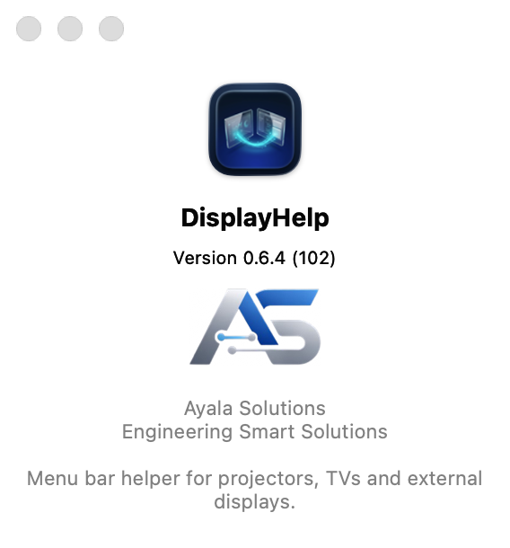</a>
</p>

Use About when your helpdesk asks which version you have.

1. Open the DisplayHelp menu and choose About in the footer.

2. Read the version shown in the About window and include it with a support request.

3. Close the About window to return to your work.

Shown: DisplayHelp 0.5.1. Most screenshots show these unchanged controls; the reset confirmation has been updated for 0.5.2.

## First plug-in

The first time a display is connected, a small dialog asks one question:

- Mirror for teaching. Both screens show the same thing.

- Extend for working. The other screen becomes a second desktop.

- Not now leaves macOS's default and asks again next time.

Choose Mirror or Extend and DisplayHelp remembers the choice for this display on this Mac. Choosing Not now leaves the decision for a later connection. Display identity depends on its manufacturer, model and serial information. Settings do not sync between Macs; use profile export and import to transfer a setup and map its devices.

### Choose what happens on connection

<p align="center">
  <a href="docs/images/first-connect.png">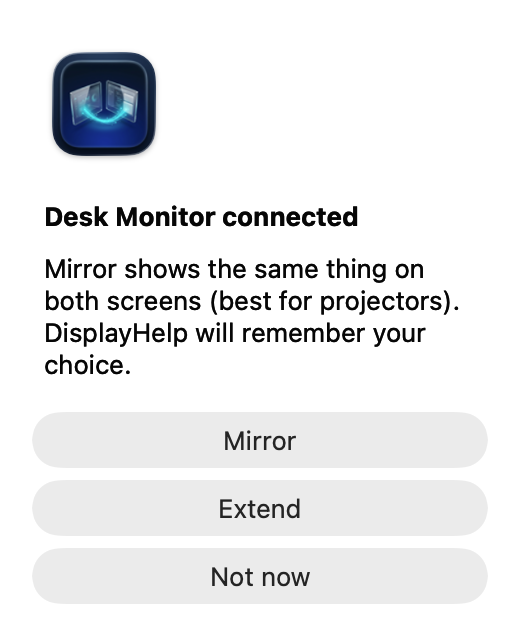</a>
</p>

This prompt appears when DisplayHelp needs an arrangement choice for an external display.

1. Connect the display and wait for the prompt.

2. Choose Mirror to show the same desktop to an audience, or Extend to gain a separate desktop.

3. Choose Not now to keep the current macOS arrangement and decide on a later connection.

Mirror or Extend is remembered for this display on this Mac.

## The menu at a glance

Click the icon. Top to bottom:

| Row | What it is |
|---|---|
| Profile | Save, preview, restore, update, remove, import and export named setups; choose automatic loading when needed. |
| Detect Displays | Rescans and applies display recommendations. It may change your current settings. |
| Display cards | One per connected display. Name, status line, and an aligned list of controls that apply to that display. |
| Fixes | Reset Display Preferences, any helpdesk scripts, and Uninstall under "More". |
| Recent Events | The last connects, disconnects, mode changes and failures. |
| Start at Login, Quit, About | Footer. |

The menu bar icon itself shows state: stacked rectangles when mirrored, two displays when extended, one when the laptop is alone.

Each card’s status line has a coloured dot. Green means the display passes the app’s status checks. Orange can mean a different mode is recommended or the external display is running below 50 Hz. Try Match Laptop or Best for Display when available. A green mirrored laptop does not mean the TV is running at the same refresh rate.

### Find the control you need

<p align="center">
  <a href="docs/images/menu.png">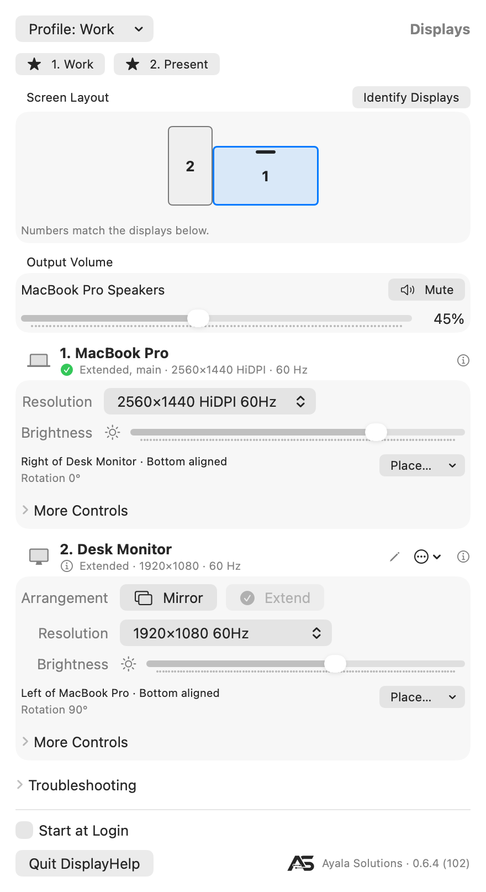</a>
</p>

The main menu groups settings into a card for each connected display.

1. Click the DisplayHelp icon in the menu bar.

2. Find the card named for the display you want to change.

3. Check its arrangement, resolution and refresh rate before choosing a control.

Shown: a mirrored Samsung TV at 30 Hz and a built-in panel at 60 Hz. The orange TV dot flags its low rate; it does not prove a faster mode is available.

## Everyday use

### "The picture is wrong, fix it"

Press Detect Displays to rescan and apply the app’s display recommendations. It can adjust resolution, refresh rate and which display leads mirroring, including correcting an unsuitable built-in display mode. Use it when you want those changes applied rather than keeping a manually selected setup.

### Mirror or Extend

Two buttons on each external display's card. The one you are on is greyed. The choice is remembered.

### Switch to separate desktops

<p align="center">
  <a href="docs/images/extend.png">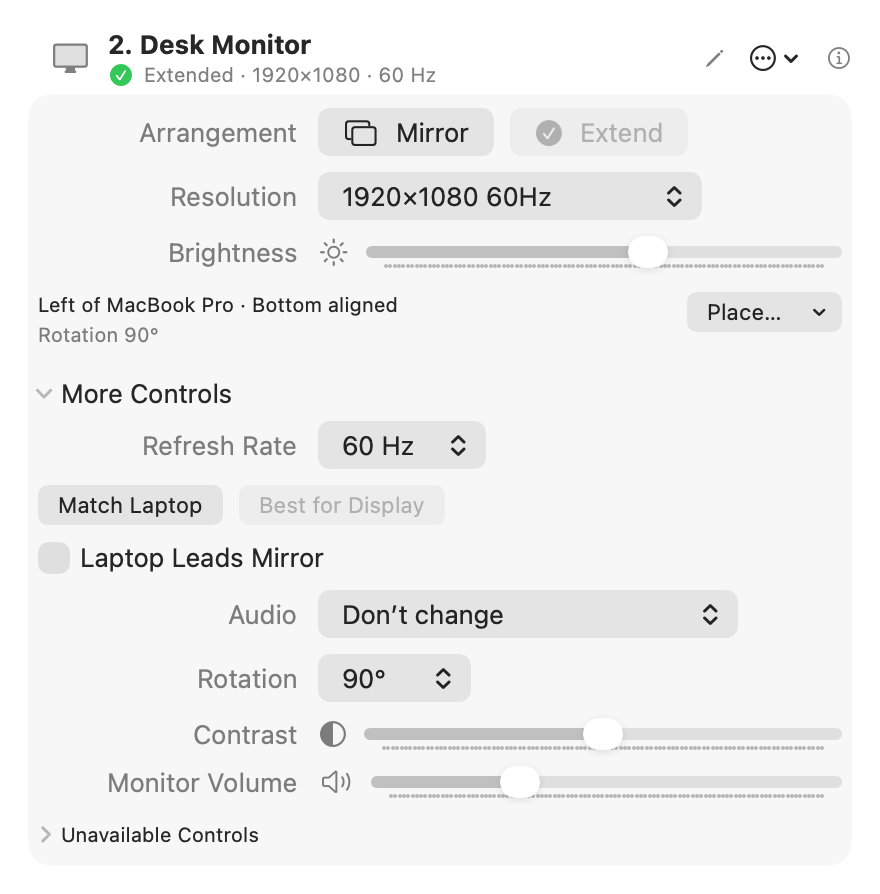</a>
</p>

Use Extend when you want different windows on the laptop and external screen.

1. Find the external display’s card and choose Extend.

2. Move a window between the screens to confirm that they act as separate desktops.

3. Use Position to match their physical placement, or choose Mirror to return to a shared desktop.

Make Main and Place… appear when the displays are extended.

### Resolution and Refresh Rate

Resolution lists available sizes and scaling options, using the highest offered refresh rate for each. When the display supplies supported-size information, DisplayHelp uses it to filter the list; otherwise it uses the modes macOS offers. The current size stays listed. Available modes depend on the display, adapter, cable and connection.

### Choose a resolution

<p align="center">
  <a href="docs/images/resolution.png">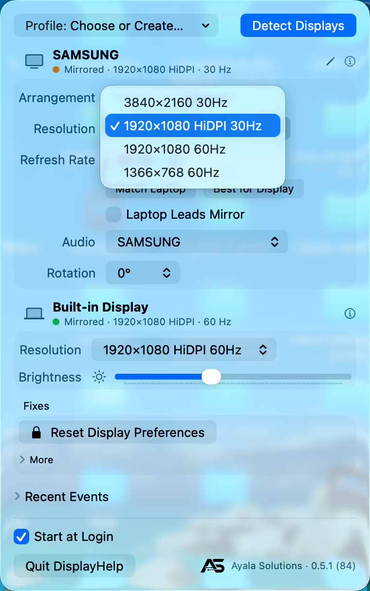</a>
</p>

Use Resolution to change desktop size or make text easier to read.

1. Open Resolution on the correct display card.

2. Choose an offered size. Use a suitable HiDPI option when available for readable, sharp text.

3. Check the picture and the status line after the setting changes.

The screenshot shows this TV’s available modes. A listed rate is the highest offered for that size; check the status line for the rate actually in use.

Refresh Rate appears when the current size offers more than one rate. Choose a rate supported by the entire connection. Higher rates generally make motion smoother; a lower rate may work better on a limited connection. The status line shows the rate actually in use.

### Choose a refresh rate

<p align="center">
  <a href="docs/images/refresh-rate.png">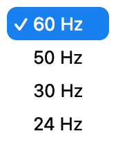</a>
</p>

Use Refresh Rate to select a different available rate for the current size.

1. Choose the resolution you intend to use.

2. Open Refresh Rate and select one of the offered rates.

3. Check that the picture is stable and confirm the new rate in the status line.

The control appears only when multiple rates are available. This example offers 30, 25 and 24 Hz; another connection may offer different rates.

### Match Laptop and Best for Display

- Match Laptop tries to match the laptop’s logical desktop size, then uses a suitable alternative when that size is unavailable.

- Best for Display prefers a suitable native-resolution mode with readable scaling when available, such as 1920×1080 HiDPI on a 4K TV. Recommendations prefer 50 Hz or better, but can fall back to a lower rate when the available modes require it.

A recommendation button is greyed out when it would not change the current mode or no suitable candidate is available. The status dot can remain orange at a low refresh rate. Mirroring keeps both displays on a shared logical desktop size; their reported refresh rates can differ.

### Laptop Leads Mirror

Off by default: the TV's shape wins, both share one size, and a 16:10 laptop shows a thin band top and bottom on a 16:9 screen. On: the laptop is full-screen and the TV shows side bars. Use it when you are working on the laptop and the audience screen is secondary. Remembered per display.

### Audio

Pick which output plays the Mac's sound whenever this display is connected: the TV's own HDMI audio, the 3.5 mm cable to the room amp, a USB dock, an AirPlay receiver, or a presentation gateway's driver. "Don't change" is the default, so plugging in to charge never hijacks a call. Remembered per display and carried in profiles.

### Choose where sound plays

<p align="center">
  <a href="docs/images/audio.png">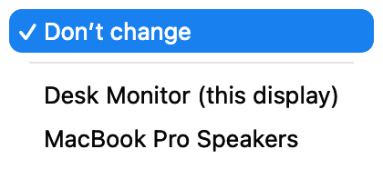</a>
</p>

Use Audio to remember a sound output for this connected display.

1. Open Audio on the external display’s card.

2. Select the TV, speakers, dock or other output you want to use.

3. Play a short sound and check that it comes from the intended device.

Don’t change leaves audio routing alone when this display connects. Available outputs depend on the connected devices.

### Rotation, Underscan, Brightness, Contrast, Volume

Controls appear only when the display, connection and available readings support them. Rotation suits portrait screens; underscan can help when edges are cut off. Built-in brightness is available when it can be read. External brightness, contrast and volume depend on display-control support and may be unavailable on a TV, adapter or port.

### Rotate a display

<p align="center">
  <a href="docs/images/rotation.png">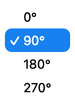</a>
</p>

Use Rotation for a screen mounted in portrait orientation or another supported position.

1. Find the intended display’s card and open Rotation.

2. Choose the angle that matches the screen’s physical orientation.

3. Check the result. Choose 0° to return to the normal orientation.

Opening the menu alone makes no change. Rotation and the other controls in this section depend on hardware support.

### Position

In Extend mode: Make Main moves the menu bar to that display, Place… puts it left, right, above or below another. Hidden while mirrored, where position has no meaning.

### Arrange extended displays

<p align="center">
  <a href="docs/images/position.png">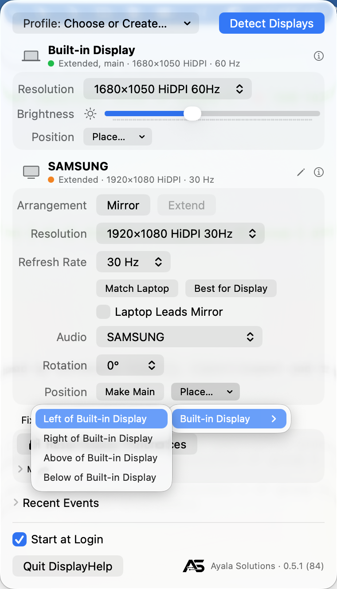</a>
</p>

Use Place… when the pointer moves between screens in the wrong direction.

1. Choose Extend if the displays are currently mirrored.

2. Open Place… on the display you want to position, then choose its direction relative to another screen.

3. Move the pointer across the shared edge to test the layout. Use Make Main if that display should hold the main desktop.

For example, choose Left of Built-in Display when the external screen sits to the left of the laptop.

### Rename

Use the pencil next to an external display’s name, type a room name and press Return. The nickname is stored for this user on this Mac. It is not transferred by profile import. Renaming cannot distinguish two displays that report the same identity.

<p align="center">
  <a href="docs/images/rename.png">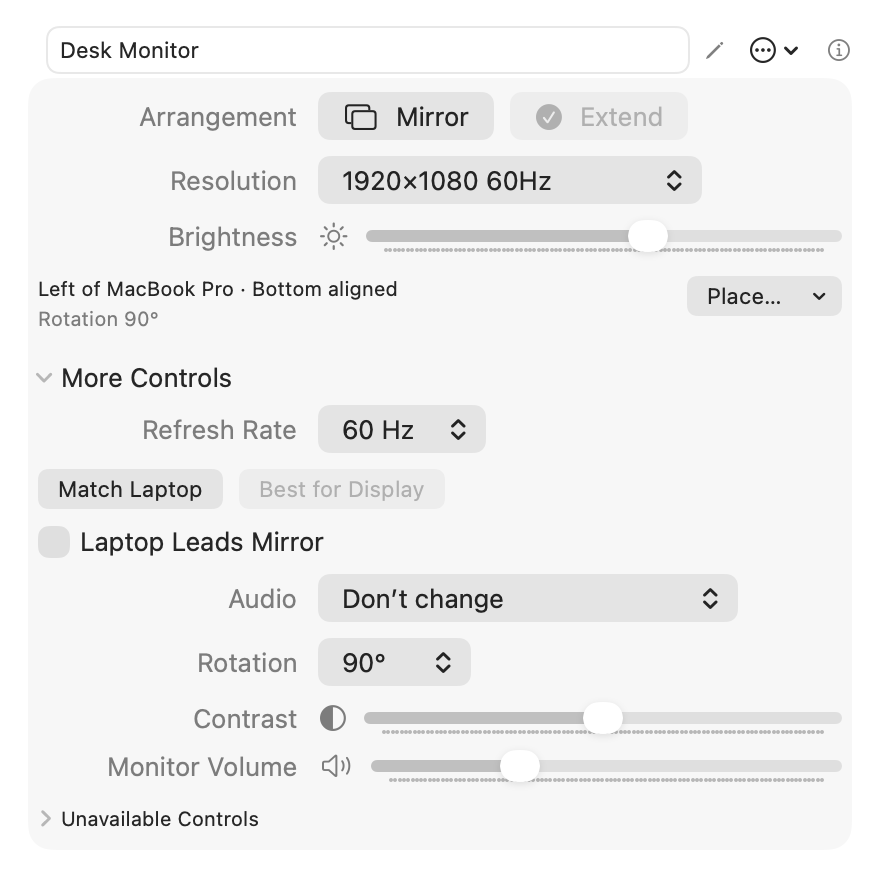</a>
</p>

Rename is active in this screenshot: “SAMSUNG” is the editable name field at the top of the display card. Replace it with a room name, then press Return to save or Escape to cancel. The normal display icon and status return when editing ends.

### Inspect display details

<p align="center">
  <a href="docs/images/display-details.png">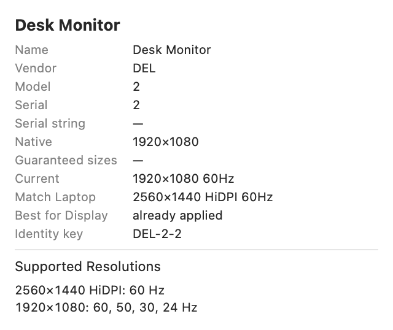</a>
</p>

Use the information popover when checking capabilities or reporting a problem.

1. Click the information button on the display’s card.

2. Review the current mode, native size and supported resolutions.

3. Give your helpdesk the relevant values, then click away to close the popover.

This view reports information; it does not apply a setting. The values shown belong to the example Samsung TV.

## Profiles: one name per room

Rooms differ. The same laptop mirrors to a 4K TV in 204, extends to a portrait screen in the library, and needs the laptop full-screen at the podium. Save each as a profile:

### Open the Profile menu

<p align="center">
  <a href="docs/images/profiles.png">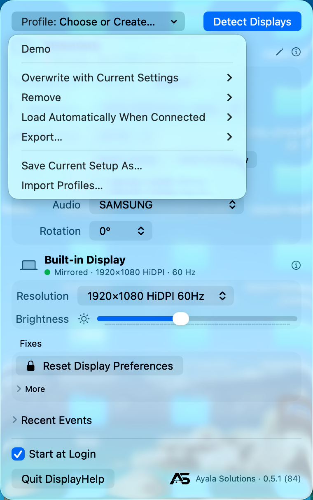</a>
</p>

A profile is a named snapshot of a complete setup.

1. Open Profile at the top of the menu.

2. Choose a saved name to preview it, or Save Current Setup As… to create a new one.

3. Use Overwrite or Remove only for the profile you intend to replace or delete.

Choosing a saved name opens a preview first. Review it before applying changes.

- Set everything the way you want it on every connected display.

- Profile › Save Current Setup As…, type the room, press Save.

- Next time, choose Profile › Room 204, review the preview and choose Apply. DisplayHelp restores the available saved settings and checks the result. Cancel closes the preview without applying changes.

### Save the current setup

<p align="center">
  <a href="docs/images/save-profile.png">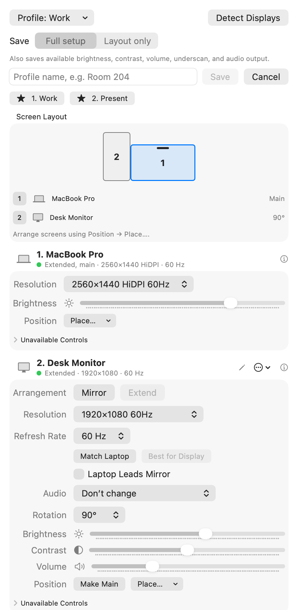</a>
</p>

Use a separate profile for each room or arrangement you want to recall.

1. Connect all displays and set the layout, picture and audio as desired.

2. Choose Profile › Save Current Setup As… and type a recognizable name.

3. Choose Save. Use Cancel if you do not want to create the profile.

Shown: naming a profile “Room 204”. Saving captures the current setup; it is not a request to change the displays.

The menu's title is the profile the displays are on right now. Change something by hand and it drops back to "Choose or Create…" because the profile no longer describes what is on screen. Overwrite with Current Settings › Room 204 replaces a profile with what is on screen now; Update "Room 204" with Current Settings is the shortcut for the one you last used. Remove deletes one.

A profile captures arrangement, size, refresh rate, readable brightness/contrast/volume, rotation, underscan, mirror leadership, display positions, the main display, per-display audio preferences, and the active system audio output. Restoration waits for pending changes and reports any settings that could not be restored or verified. The profile name appears only when all saved settings and connected displays match; status refreshes while the menu is open.

Older profiles still load. Re-save them to capture settings that older versions did not store. Saved per-display choices are used when reconnecting; a full profile restore also restores the saved layout and system audio. Displays outside the profile receive no saved settings, although macOS may reposition them when the main display changes. Identical reported display identities prevent saving an unambiguous profile.

### Preview, automatic loading and sharing

Selecting a profile opens a read-only preview of current → saved values, missing displays and unavailable audio or modes. Choose Apply, Apply to Connected Displays, or Cancel. Hardware readback still verifies the result.

### Preview and restore a profile

<p align="center">
  <a href="docs/images/restore-preview.png">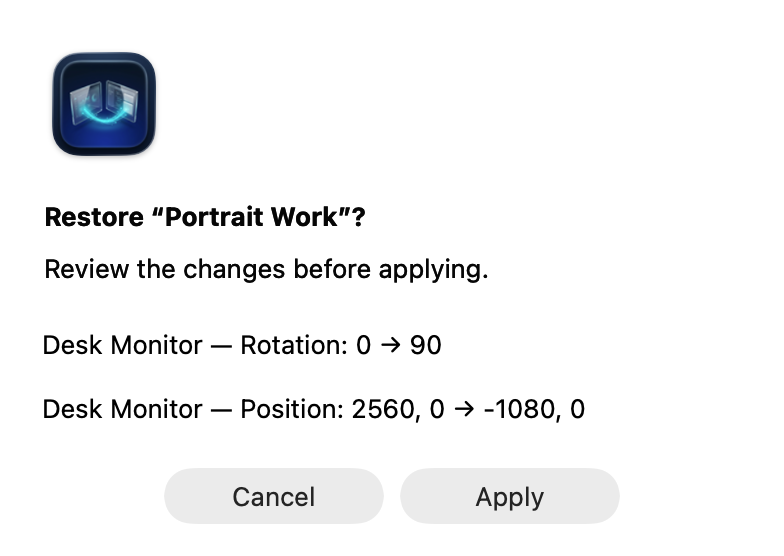</a>
</p>

The preview shows the differences between the current setup and the saved one.

1. Choose the saved profile from the Profile menu.

2. Review the proposed changes and any missing-device or unavailable-setting messages.

3. Choose Apply, or Apply to Connected Displays when offered. Choose Cancel to make no changes.

4. Check the restore result for settings that could not be restored or verified.

Shown: the Demo profile proposes changing built-in brightness from 41 to 42.

Profile › Load Automatically When Connected opts a profile into loading when its exact display set connects or at app launch. Automatic loading waits for connection changes to settle and runs once for that connection set; manually changing a resolution does not reload it. Conflicting automatic matches are not applied.

### Enable automatic profile loading

<p align="center">
  <a href="docs/images/automatic-profile.png">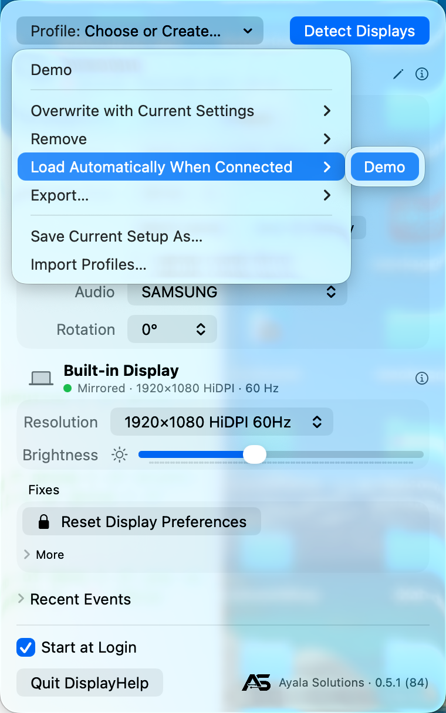</a>
</p>

Use this when a known combination of displays should load the same setup on connection.

1. Save and test the profile with all intended displays connected.

2. Open Profile › Load Automatically When Connected and select the intended profile.

3. On the next connection of that exact display set, confirm the expected setup and check any restore result.

Automatic loading requires an exact, unambiguous match. Imported profiles start with it disabled; conflicting matches are not applied.

Profile › Export… shares one or all saved profiles. Import Profiles… lets you map saved displays and audio outputs to devices on this Mac. Existing profiles are kept, duplicate names receive numbered suffixes, and imported profiles start with automatic loading disabled. Importing does not apply the setup. Review its preview before applying, and enable automatic loading only when wanted. Profiles with unmapped devices can be kept for later.

### Import a shared profile

<p align="center">
  <a href="docs/images/import-mapping.png">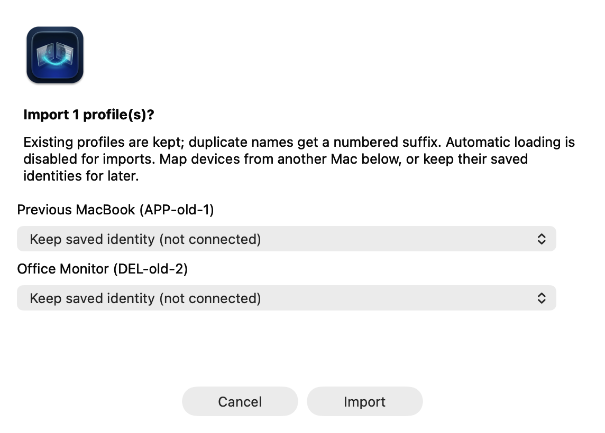</a>
</p>

Use Import Profiles… to bring a saved setup from another Mac into this one.

1. On the original Mac, choose Profile › Export… and share the exported profile with the intended recipient.

2. On this Mac, choose Profile › Import Profiles… and select the exported profile.

3. Review the display and audio mappings. Choose Import when ready.

4. Open the imported profile’s preview before applying it.

The dialog uses sample profile data. Existing profiles are preserved, duplicate names receive numbered suffixes, and automatic loading starts disabled.

### Choose the matching display

<p align="center">
  <a href="docs/images/import-display-choices.png">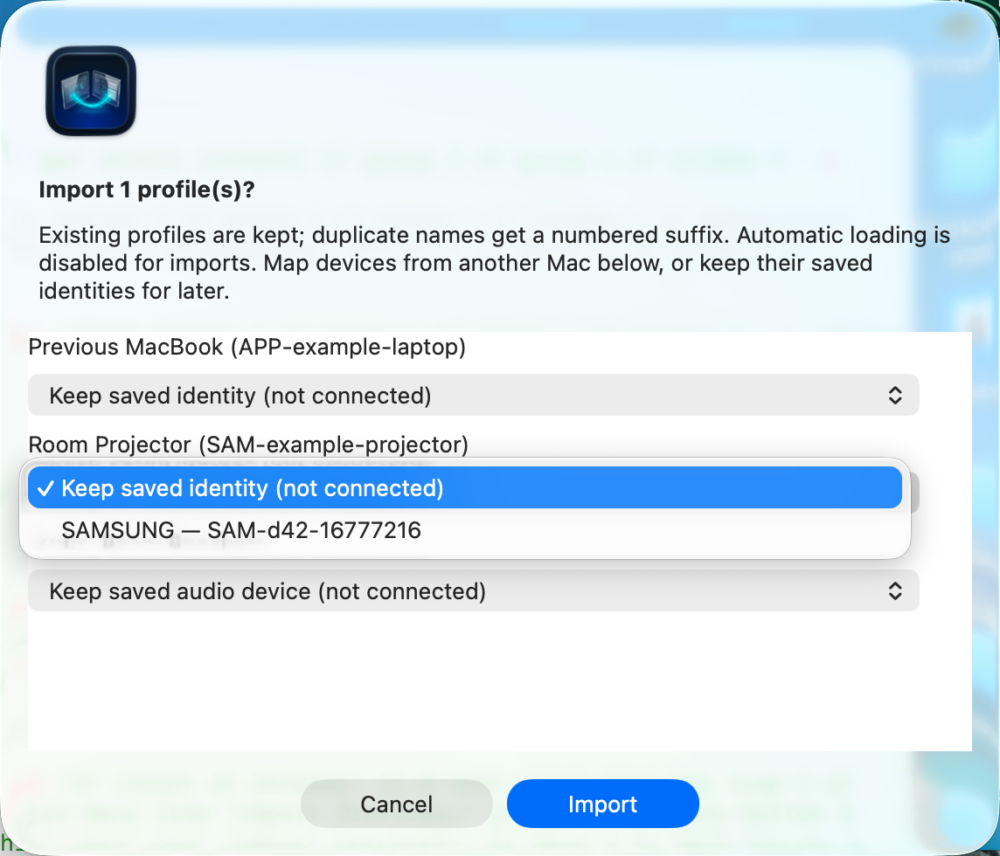</a>
</p>

Use each display selector to map the saved device to its counterpart on this Mac.

1. Open the selector below the saved display’s name.

2. Choose the connected display that should receive those saved settings.

3. If that device is absent, keep its saved identity for later. Review the other mappings before importing.

Sample data: a saved projector is being mapped to the connected Samsung. Do not map two different saved displays to the same destination.

## Fixes

- Reset Display Preferences clears macOS’s saved display configuration and restarts the display session. Everyone using the Mac is logged out, so save work first. Use it when display problems persist after trying the ordinary controls. It requires an administrator password. Starting with 0.5.2, ColorSync profile files are preserved. Older installers may remove certain display-profile folders; update before resetting a calibrated system.

### Find the troubleshooting actions

<p align="center">
  <a href="docs/images/fixes.png">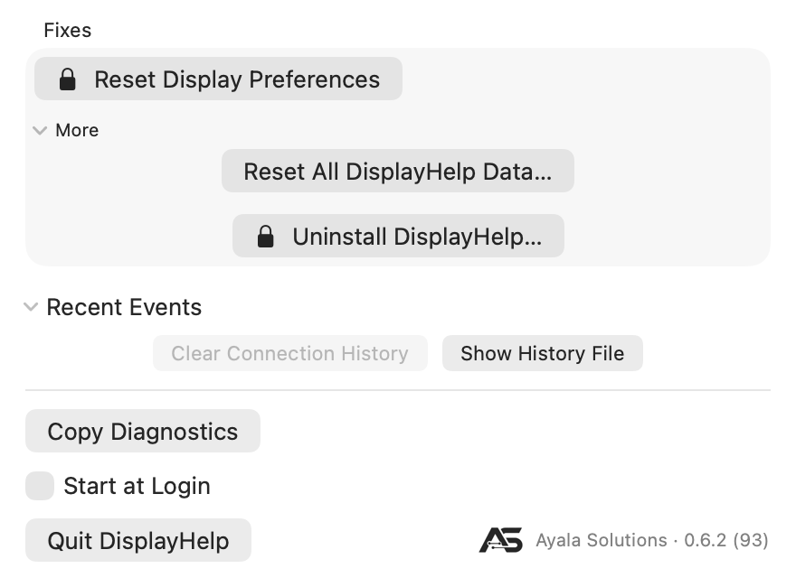</a>
</p>

The Fixes area contains Reset and any extra actions supplied by your helpdesk.

1. Open the DisplayHelp menu and find Fixes.

2. Choose Reset Display Preferences only when the ordinary controls have not solved the problem.

3. Read the confirmation before proceeding. The More menu also contains Uninstall.

Opening a menu does not run a fix. Reset and Uninstall are separate actions; choose the one you intend.


### What Reset Display Preferences runs

This is the complete script the app runs, as root, when you confirm Reset Display Preferences. It is also available as [reset-display-prefs.sh](reset-display-prefs.sh). It removes only WindowServer display settings; ColorSync profile files are not touched. Everyone is logged out when WindowServer restarts.

```zsh
#!/bin/zsh
# name: Reset Display Preferences
# description: Clears system and per-user WindowServer display settings while preserving ColorSync profiles, then restarts WindowServer. This logs everyone out immediately. Needs an administrator password.
# admin: true
set -euo pipefail
setopt null_glob

# System-wide WindowServer preferences/database
rm -f /Library/Preferences/com.apple.windowserver*.plist
rm -rf /private/var/db/WindowServer

# Clear per-user settings for all users with home folders
for HOME_DIR in /Users/*; do
    [ -d "$HOME_DIR" ] || continue
    rm -f "$HOME_DIR"/Library/Preferences/ByHost/com.apple.windowserver.displays*.plist 2>/dev/null
done

echo "Display preferences reset, restarting WindowServer"
# Restart WindowServer
killall -HUP WindowServer
```

### Review the reset warning

<p align="center">
  <a href="docs/images/reset-confirmation.png">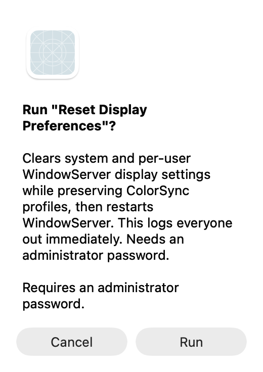</a>
</p>

Reset is a troubleshooting action that logs everyone out.

1. Save all open work and confirm that other users are ready to be logged out.

2. Read the confirmation carefully. Choose Cancel if you are not ready.

3. Choose Run only when you intend to reset the display configuration, then authenticate through macOS.

Use this after ordinary display controls have failed, preferably with your helpdesk’s guidance. Shown: the 0.5.2 confirmation, which explicitly preserves ColorSync profiles. Cancel was used to capture this screen; the reset was not run.

### Custom Fixes: install and use your own actions

Custom Fixes are optional troubleshooting actions supplied as separate scripts. They work with DisplayHelp 0.5.1 and later. There is no upload website: install them locally for the user who runs DisplayHelp.

#### Included examples

Demo — Test Custom Fixes confirms that setup works. It changes no settings, restarts nothing and needs no administrator password.

Restart Dock briefly closes the Dock; macOS reopens it automatically. Use it if the Dock stays misplaced after connecting a display. It does not reset display preferences or delete ColorSync profiles. This is separate from Reset Display Preferences.

#### Where to put the scripts

```text
~/Library/Application Support/DisplayHelp/scripts/
```

The ~ means the current user’s home folder. Install here, not inside the app and not in a shared system folder. Each Mac user has a separate Custom Fixes folder.

#### Install the examples

1. Open the supplied “DisplayHelp Custom Fixes” archive. Keep the extracted folder, which contains the two scripts and a README with additional instructions.

2. If the destination folder does not exist, open Terminal and run this one command:

```zsh
mkdir -p "$HOME/Library/Application Support/DisplayHelp/scripts"
```

3. In Finder, choose Go › Go to Folder and paste the destination shown above.

4. Copy demo.sh and, if wanted, restart-dock.sh into that folder. Copy the files themselves, not their enclosing folder. If a file with that name already exists, keep a backup before replacing it.

<p align="center">
  <a href="docs/images/custom-fixes-folder.png">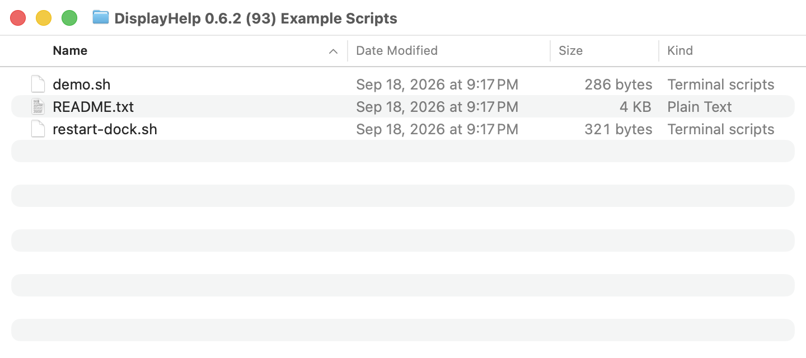</a>
</p>

Place the two script files directly in the scripts folder. Do not place their enclosing folder here. Install just the demo if you only want to test setup.

5. Close and reopen the DisplayHelp menu. The actions should appear under Custom Fixes.

<p align="center">
  <a href="docs/images/custom-fixes-menu.png">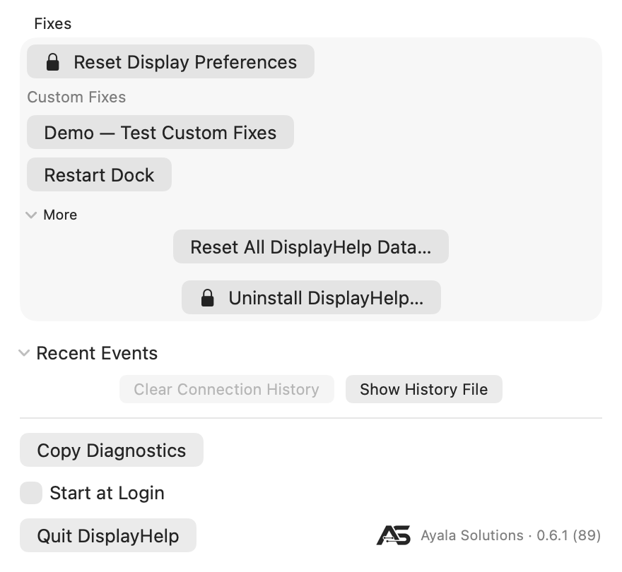</a>
</p>

The installed scripts appear as named buttons under Custom Fixes. Choose Demo — Test Custom Fixes first; Restart Dock is a separate, optional action.

#### Run the demo first

1. Under Custom Fixes, choose Demo — Test Custom Fixes.

2. Read the confirmation. Choose Run to test it, or Cancel to leave it untouched.

<p align="center">
  <a href="docs/images/custom-fixes-confirmation.png">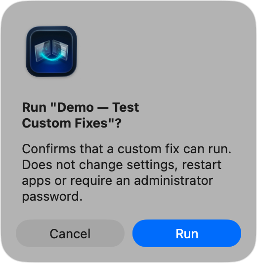</a>
</p>

Review the action before running it. This demo requests no administrator password and changes no settings. Choose Run to continue or Cancel to stop.

3. Look below Fixes for “exit 0” and “Demo successful — Custom Fixes is working. No settings were changed.” Recent Events also records the outcome.

<p align="center">
  <a href="docs/images/custom-fixes-success.png">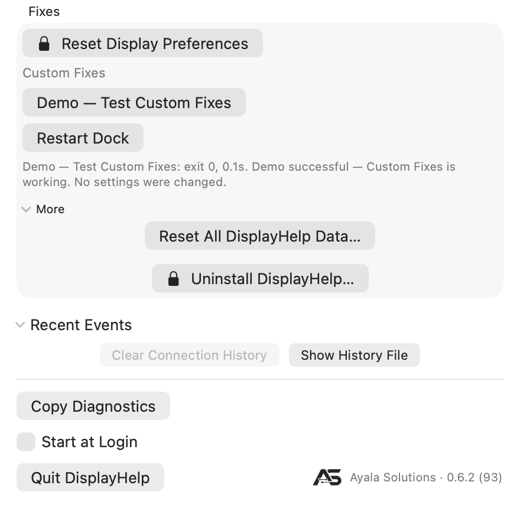</a>
</p>

A successful test displays exit 0 and the demo success message beneath the custom actions. This is the actual result from running the supplied demo in DisplayHelp.

4. Choose Restart Dock only when you intend to refresh the Dock. It briefly disappears and returns. A nonzero exit means the command failed; for example, the Dock may not be running.

#### If the actions do not appear

Check that the files are directly inside the scripts folder and end in .sh, not .sh.txt. They must belong to the user running DisplayHelp. Symbolic links and files writable by everyone are ignored. The supplied README includes installation commands that set suitable permissions. Reopen the menu after correcting the files.

#### Remove a custom action

Move its script out of the scripts folder, then reopen the menu. This removes the action without deleting your display profiles or app settings.

#### For helpdesks creating scripts

Create a plain-text zsh script ending in .sh. The README explains the name, description and admin header comments, which must be in the first 20 lines. The name is the menu label, and the description explains the action before it runs. Set admin to true only when administrator access is necessary; macOS handles authentication.

Scripts run without an interactive Terminal. Do not wait for typed input. Use a zero exit status for success and a nonzero status for failure, and make the last output line a clear result. Administrative scripts run as root and must explicitly target the intended user.

For managed deployment, install approved scripts separately for each intended user, owned by that user with permissions 0755. Only install scripts whose contents and effects you trust.

- More › Uninstall DisplayHelp… 🔒 removes the app, its login item and package receipt, and optionally your saved profiles and settings.


### What Uninstall DisplayHelp runs

This is the complete script behind More › Uninstall DisplayHelp…, also available as [uninstall.sh](uninstall.sh). The app first unregisters its login item and quits, then runs this as root. `keep` leaves your saved profiles and settings; `purge` removes them too. MDM can run the bundled copy directly.

```zsh
#!/bin/zsh
# Removes DisplayHelp: the app bundle, its package receipt, and (with "purge") the user's saved displays, profiles and history.
# Run as root. The app unregisters its login item and quits itself; MDM can run this directly:
#   sudo /bin/zsh uninstall.sh /Applications/DisplayHelp.app purge /Users/<name>
set -euo pipefail
APP=${1:?app path}
MODE=${2:-keep}
USER_HOME=${3:-}

case "$APP" in
    */DisplayHelp.app) ;;
    *) echo "refusing to remove '$APP': not DisplayHelp.app"; exit 2 ;;
esac
[ -d "$APP" ] && rm -rf "$APP"
pkgutil --forget com.displayhelp.app >/dev/null 2>&1 || true
if [ "$MODE" = purge ] && [ -n "$USER_HOME" ] && [ -d "$USER_HOME/Library/Application Support/DisplayHelp" ]; then
    rm -rf "$USER_HOME/Library/Application Support/DisplayHelp"
fi
echo "DisplayHelp removed"
```

## When something still looks off

| You see | Do this |
|---|---|
| Dock half cut off after plugging in | Wait two seconds. The app restarts the Dock itself. Else press Detect Displays. |
| Snow or "no signal" on a TV after picking a size | Try a supported size such as 1920×1080. Check the cable, adapter and display input if the problem continues. |
| Everything tiny on the TV | Try Best for Display or choose a readable HiDPI size when available. |
| Black band top and bottom of the laptop while mirrored | Normal for a 16:10 laptop on a 16:9 screen. Turn on Laptop Leads Mirror or use Extend. |
| Display drops and returns every ten seconds | Reseat the cable. Recent Events will show connect/disconnect pairs with no mode change between them. That is the link, not a setting. |
| The app asks Mirror/Extend again for a display it knew | The reported display identity may have changed, or saved settings were removed. Choose the arrangement again. |
| The card says "Display 2" instead of the TV's name | The TV's identity arrived late. The app re-reads it within two seconds. |

If the problem continues, open Recent Events and share the relevant details with your helpdesk. Include the display model, cable or adapter, arrangement, chosen resolution and refresh rate.

### Use Recent Events for support

<p align="center">
  <a href="docs/images/recent-events.png">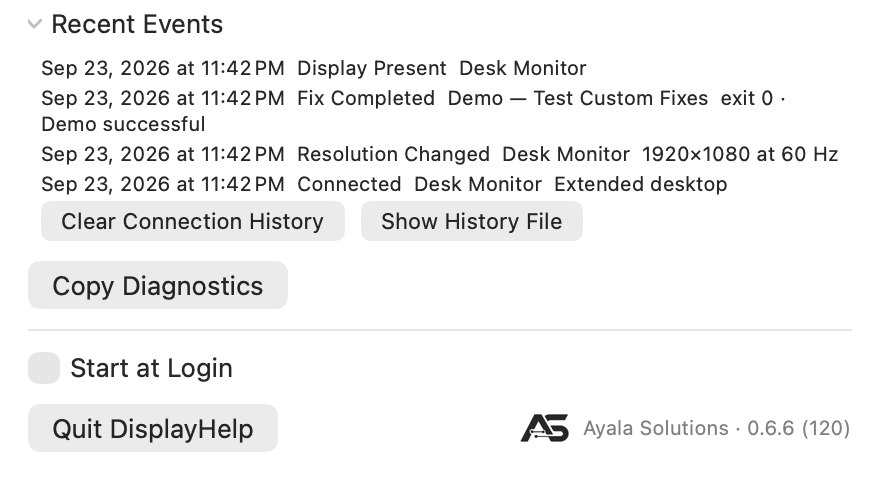</a>
</p>

Recent Events helps you see what changed around the time a problem occurred.

1. Open the DisplayHelp menu and expand Recent Events.

2. Look for connection changes, setting changes or failures near the time of the problem.

3. Share the relevant event details with your helpdesk, together with the display, cable, arrangement and version.

Record useful details before choosing Clear. Opening Recent Events does not change display settings.

## Where it keeps things

DisplayHelp keeps your saved display choices, profiles and recent activity locally in your macOS user account. Different users and different Macs keep separate settings. Use the app’s profile export and import controls to move saved setups.

| Saved information | Contents |
|---|---|
| Display preferences | Names and per-display choices used on this Mac |
| Profiles | Named setups with display, layout and audio settings |
| Recent activity | Connection, setting-change and troubleshooting events |
| Helpdesk fixes | Optional actions supplied by your organization |

Quit DisplayHelp before your IT team restores a backup of its saved settings, then reopen it. Exporting profiles does not transfer display nicknames or recent activity.

## Privacy

DisplayHelp makes no network connections. It reads display identity and keeps settings and activity locally, with diagnostics also available through macOS. Export writes profiles to a location you choose; they include display and audio identifiers, so share them only with the intended recipients. Administrator authentication for Reset and Uninstall is handled by macOS.

## Helpdesk deployment

| Step | What to check |
|---|---|
| Requirements | macOS 14 or later on Apple Silicon or Intel Macs. |
| Install | Deploy the signed and notarized installer with your organization’s Mac management service. |
| Pilot | Test representative rooms, displays, adapters, audio outputs and reconnect behaviour before wider deployment. |
| Profiles | Import a saved setup on each destination Mac, map its devices, preview it and verify the result. |
| Automatic loading | Enable only after the intended exact display set has been tested. Imported profiles start with it disabled. |
| Support | Use Recent Events and the actual connection details when investigating a problem. |
| Removal | Use the app’s Uninstall command. Choose whether saved profiles and settings should also be removed. |

DisplayHelp is made by Ayala Solutions. Engineering Smart Solutions.

## Example custom scripts

These optional files are distributed separately from the app. They run locally; nothing is uploaded. The demo is the recommended first test.

### Demo — Test Custom Fixes

[Download the demo script](examples/custom-fixes/demo.sh), also included in the [Custom Fixes archive](https://github.com/hov172/DisplayHelp/releases/download/v0.5.2/DisplayHelp-0.5.2-Custom-Fixes.zip).

```zsh
#!/bin/zsh
# name: Demo — Test Custom Fixes
# description: Confirms that a custom fix can run. Does not change settings, restart apps or require an administrator password.
# admin: false
set -euo pipefail

echo "Demo successful — Custom Fixes is working. No settings were changed."
```

### Restart Dock

[Download the optional Dock restart script](examples/custom-fixes/restart-dock.sh), also included in the [Custom Fixes archive](https://github.com/hov172/DisplayHelp/releases/download/v0.5.2/DisplayHelp-0.5.2-Custom-Fixes.zip).

This briefly restarts the Dock. It does not reset display preferences or delete color profiles.

```zsh
#!/bin/zsh
# name: Restart Dock
# description: Briefly closes and restarts your Dock to refresh its position after a display change. Does not reset display preferences or remove ColorSync profiles.
# admin: false
set -euo pipefail

/usr/bin/killall Dock
echo "Dock restart requested. macOS will reopen it automatically."
```

### Install from Downloads

Extract the Custom Fixes archive into Downloads, then run these commands as the signed-in user, without sudo. Back up any custom script with the same filename before replacing it.

```zsh
mkdir -p "$HOME/Library/Application Support/DisplayHelp/scripts"
install -m 755 "$HOME/Downloads/DisplayHelp Custom Fixes/demo.sh" "$HOME/Library/Application Support/DisplayHelp/scripts/demo.sh"
install -m 755 "$HOME/Downloads/DisplayHelp Custom Fixes/restart-dock.sh" "$HOME/Library/Application Support/DisplayHelp/scripts/restart-dock.sh"
```

The third command is optional. Reopen the DisplayHelp menu and run the demo to verify installation. See the [complete Custom Fixes instructions](examples/custom-fixes/README.txt) for script headers and managed deployment.

Further reference: [documentation index](docs/README.md), [release history](CHANGELOG.md).

## License

DisplayHelp is proprietary software by Ayala Solutions. It is not open source. This repository holds only the public documentation, release downloads and the helper scripts shown above; the application's source code is private and is not published here. The app is distributed as a signed and notarized installer under the terms provided with each release.

The example custom-fix scripts, the reset script and the uninstall script may be copied and adapted for use with DisplayHelp.
