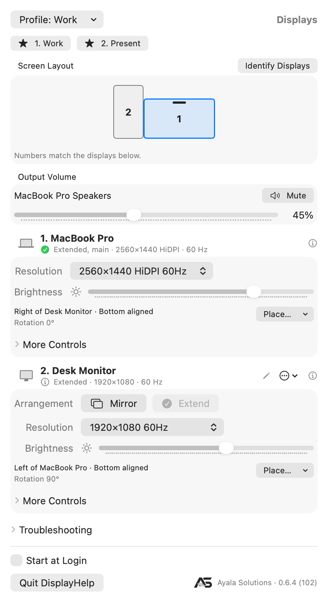
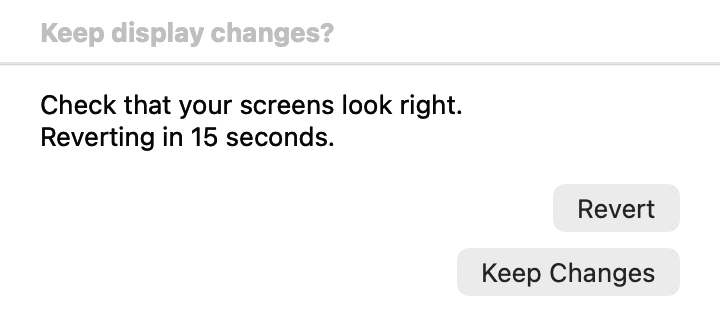
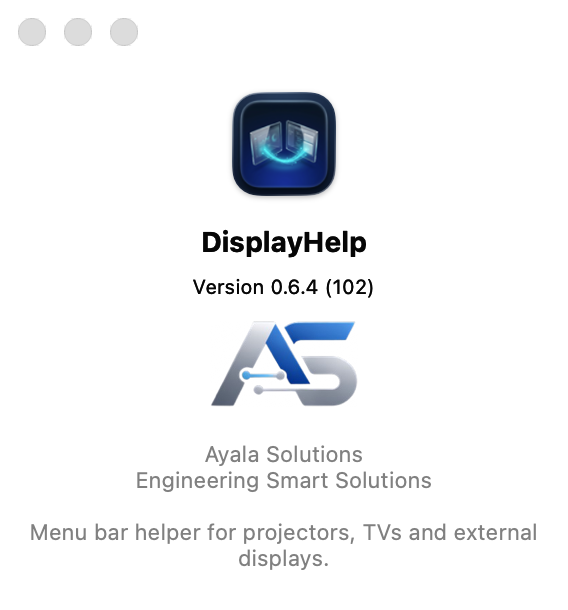
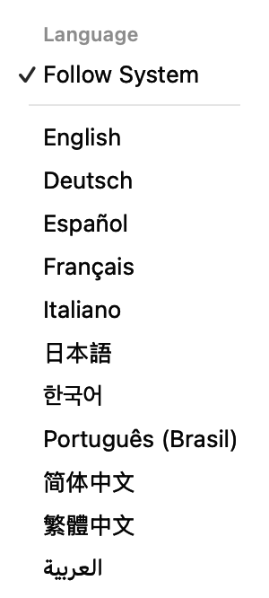
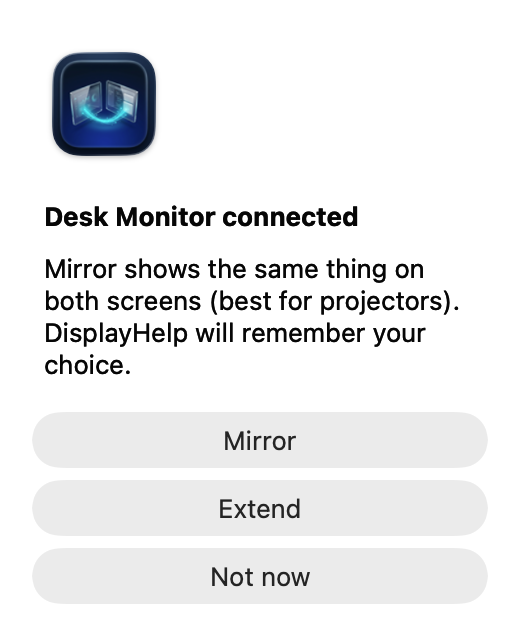
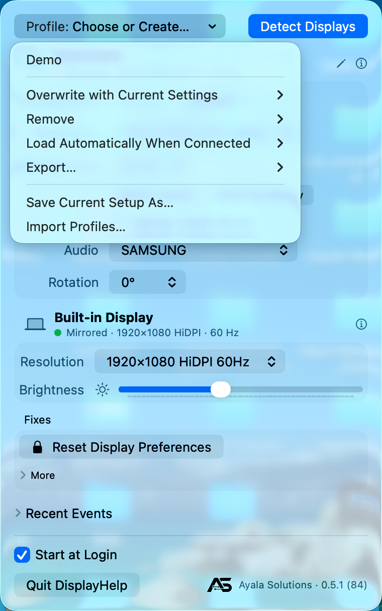
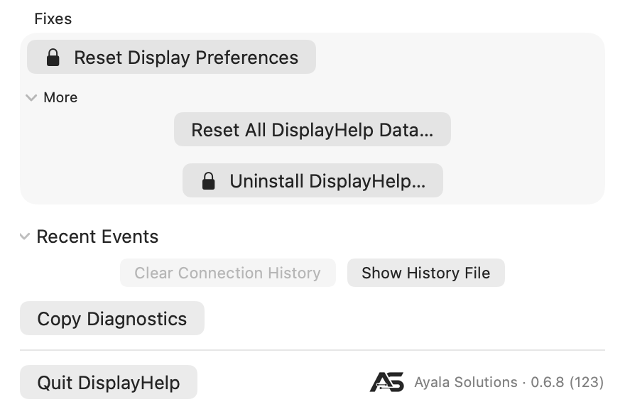
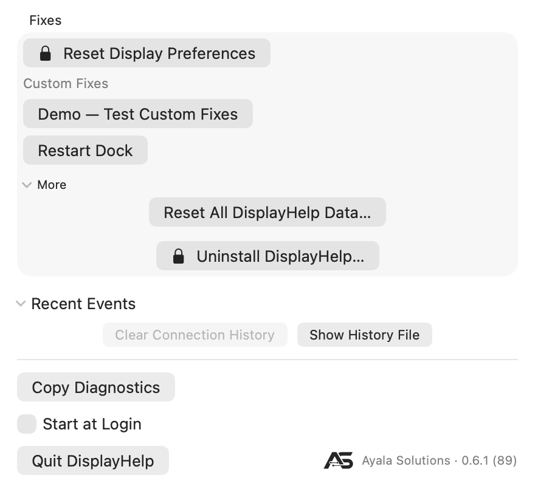

# DisplayHelp

DisplayHelp is a menu bar app for macOS that makes projectors, TVs and external displays behave. Plug in, answer one question, and it remembers the room. Built by Ayala Solutions for school helpdesks and for anyone who connects a Mac to a different screen every day.

Latest release **0.6.9 (125)** • macOS 14 Sonoma or later • Apple Silicon and Intel • Proprietary, not open source

Feedback, bug reports and suggestions are welcome.

### Downloads

- [Signed and notarized installer](https://github.com/hov172/DisplayHelp/releases/download/v0.6.9/DisplayHelp-0.6.9.pkg)
- [Public guide — Word](https://github.com/hov172/DisplayHelp/releases/download/v0.6.9/DisplayHelp-0.6.9-User-Guide.docx)
- [Public guide — PDF](https://github.com/hov172/DisplayHelp/releases/download/v0.6.9/DisplayHelp-0.6.9-User-Guide.pdf)
- [Custom Fixes examples and installation README](https://github.com/hov172/DisplayHelp/releases/download/v0.6.9/DisplayHelp-0.6.9-Custom-Fixes.zip)
- [Current UI screenshots](https://github.com/hov172/DisplayHelp/releases/download/v0.6.9/DisplayHelp-0.6.9-Screenshots.zip)
- [SHA-256 checksums](https://github.com/hov172/DisplayHelp/releases/download/v0.6.9/SHA256SUMS.txt)

<p align="center">
  <a href="docs/images/menu-viewport.png"></a>
</p>

Screenshots use sample display data rendered by the production views; the screen diagram shows geometry, not desktop content. Menu captures show 0.6.8 (124); 0.6.9 adds a Check for Update… button beside Quit in the footer. Other captures are from 0.6.6 and show controls unchanged in 0.6.9. [Screenshot details](docs/README.md#screenshots).

<p align="center">
  <a href="docs/images/keep-changes.png"></a>
</p>

- macOS 14 Sonoma or later, Apple Silicon and Intel.

- One menu bar icon, no main window and no account. Settings stay on your Mac; profile sharing is your choice.

- Installs with a signed and notarized installer, starts at login and can uninstall itself.

**What's new:** see [CHANGELOG.md](CHANGELOG.md) for every version's changes.

## Contents

- [Why it exists](#why-it-exists)
- [Install](#install)
- [Languages and how to switch](#languages-and-how-to-switch)
- [First plug-in](#first-plug-in)
- [The menu at a glance](#the-menu-at-a-glance)
- [Everyday use](#everyday-use)
- [Output Volume](#output-volume)
- [Identify your screens](#identify-your-screens)
- [Choose and save the main screen](#choose-and-save-the-main-screen)
- [Profiles: one name per room](#profiles-one-name-per-room)
- [Clear history, forget a display, or start fresh](#clear-history-forget-a-display-or-start-fresh)
- [Fixes](#fixes)
- [Custom Fixes setup](#custom-fixes-install-and-use-your-own-actions)
- [When something still looks off](#when-something-still-looks-off)
- [Where it keeps things](#where-it-keeps-things)
- [Privacy](#privacy)
- [Helpdesk deployment](#helpdesk-deployment)
- [Example custom scripts](#example-custom-scripts)

This README is the short version. The [user guide](docs/user-guide.md) covers every control, the [FAQ](docs/faq.md) gives short answers, and [troubleshooting](docs/troubleshooting.md) goes symptom by symptom.

## Why it exists

Every teacher has lived this. The projector shows a stretched picture. The Dock is half off the screen. The text is tiny. The laptop shows a black band. The TV shows snow. macOS can fix all of it if you know which of four panes to open, but the person at the front of the room has thirty seconds and a class waiting.

DisplayHelp puts the handful of things that actually fix these problems in one menu, applies them automatically once it has seen a display, and keeps a log so the helpdesk can see what happened when someone calls. It was built against real hardware, and every default in it came from a problem that showed up on a real TV or projector.

| Problem | What DisplayHelp does |
|---|---|
| Wrong resolution after plugging in | Remembers the right one per display and re-applies it on every reconnect |
| Dock half cut off | Restarts the Dock after the display settles |
| Snow on a TV | Filters sizes using the display’s supported-size information when available |
| Tiny UI on a 4K TV | Prefers readable HiDPI scaling when a suitable mode is available |
| Laptop and TV on different sizes | Keeps a mirror set on one logical size in both directions |
| Different rooms, different needs | Named profiles that capture every connected display |
| "It just keeps coming up wrong" | One-click reset of macOS's display database |

## Install

- Get the latest signed and notarized DisplayHelp installer from Ayala Solutions or your organization’s helpdesk. Open it and follow the installation prompts. The app installs in Applications and starts automatically.

- Look for the display icon in the menu bar. That is the whole app.

- It starts at login for everyone who uses the Mac, so it is there tomorrow. To stop that for your account, turn DisplayHelp off in System Settings › General › Login Items › Allow in the Background.

For organization-wide installation, ask your IT team to deploy the installer through its Mac management service and test it in representative rooms first. See [rollout](docs/rollout.md).

### Check your installed version

<p align="center">
  <a href="docs/images/about.png"></a>
</p>

Open the DisplayHelp menu and click **Ayala Solutions · ‹version›** at the bottom right. Include the version shown in About with any support request. Shown: the 0.6.6 About panel; 0.6.9 reads 0.6.9 (125).

## Languages and how to switch

DisplayHelp is available in eleven languages:

| Language | Name shown in the globe menu |
|---|---|
| English | English |
| German | Deutsch |
| Spanish | Español |
| French | Français |
| Italian | Italiano |
| Japanese | 日本語 |
| Korean | 한국어 |
| Brazilian Portuguese | Português (Brasil) |
| Simplified Chinese | 简体中文 |
| Traditional Chinese | 繁體中文 |
| Arabic | العربية |

<p align="center">
  <a href="docs/images/language-menu.png"></a>
</p>

DisplayHelp follows your Mac's language preferences by default. To use a different language in DisplayHelp only, click the **globe** at the top of the menu, choose a language by its native name, then **Restart Now**. Choose **Follow System** to return to the Mac's preferences. Both routes use Apple's native per-app language preference and the same bundled translations; no online translation service is used, and macOS does not generate missing translations. Language is separate from display profiles.

Translations are machine-assisted and checked against Apple terminology; corrections are welcome via [GitHub issues](https://github.com/hov172/DisplayHelp/issues).

Full details, including the System Settings routes: [user guide › Language](docs/user-guide.md#language).

## First plug-in

The first time a display is connected, a small dialog asks one question:

<p align="center">
  <a href="docs/images/first-connect.png"></a>
</p>

- **Mirror** for teaching. Both screens show the same thing.
- **Extend** for working. The other screen becomes a second desktop.
- **Not now** leaves macOS's default and asks again next time.

Mirror or Extend is remembered for this display on this Mac. Settings do not sync between Macs; use profile export and import to transfer a setup. See [the connect dialog](docs/user-guide.md#the-connect-dialog).

## The menu at a glance

Click the icon. Top to bottom:

| Row | What it is |
|---|---|
| Profile, Displays heading, globe | Save, preview, restore, update, remove, import and export named setups; the globe at the right end chooses an app language or Follow System (restart to apply). |
| Quick Switch Profiles | Favorite 1 (⌘⌥1) and Favorite 2 (⌘⌥2) slots, Save Current Setup as Default, and the Restore Previous Setup / Restore Default Setup buttons. |
| Screen Layout | Numbered geometry preview with Identify Displays in its header. |
| Output Volume | Live volume and mute for the active macOS audio output, when supported. |
| Display cards | Common controls, the HDCP state at the end of the status line, plus observed placement, alignment and rotation beside Place…. Expand More Controls for refresh rate, recommendations, audio, rotation, Check HDCP and the rest. |
| Troubleshooting | Detect Displays (applies recommendations), fixes, Recent Events with Show History File, and Copy Diagnostics. Reset All DisplayHelp Data and Uninstall are under More. |
| Quit DisplayHelp, Ayala Solutions · version | Footer; the version button opens About. |

<p align="center">
  <a href="docs/images/menu.png"></a>
</p>

The menu bar icon itself shows state: stacked rectangles when mirrored, two displays when extended, one when the laptop is alone.

Each card’s status line starts with an icon. A green check means the display is on a mode the app would choose. A grey ⓘ means a different mode is recommended or the external display is running below 50 Hz; when a faster rate exists at the same size, an orange one-click hint appears under the line. The status line ends with the HDCP state macOS reports; **Check HDCP** under More Controls reads it again. DisplayHelp only reads HDCP state; it never changes or negotiates protection.

Every row is described in the [user guide](docs/user-guide.md#display-cards).

## Everyday use

- **"The picture is wrong, fix it":** open **Troubleshooting → Detect Displays** to rescan and apply the app’s recommendations for resolution, refresh rate and which display leads mirroring.
- **Mirror or Extend:** two buttons on each external display's card. The one you are on is greyed. The choice is remembered.
- **Place…:** appears beside the current placement and rotation when displays are extended; put a display left, right, above or below another with edge or center alignment. **Make Main** is inside that menu.
- **Resolution:** lists available sizes and scaling options, filtered by the display's supported-size information when available. **Refresh Rate** is under **More Controls** when the current size offers more than one rate.
- **Match Laptop / Best for Display:** under **More Controls** on an external card; one-click recommendations that prefer readable HiDPI modes and 50 Hz or better.
- **Laptop Leads Mirror:** off by default, so the TV's shape wins. On, the laptop is full-screen and the TV shows side bars.
- **Audio:** under **More Controls**; which output plays the Mac's sound whenever this display is connected. "Don't change" is the default, so plugging in to charge never hijacks a call.
- **Rotation, Underscan, Brightness, Contrast, Monitor Volume:** appear only when the display, connection and available readings support them.
- **Rename:** the pencil next to an external display’s name stores a room name for this user on this Mac.
- **ⓘ:** the information popover shows the current mode, native size and supported resolutions for support requests.

Step-by-step instructions with screenshots for each control: [user guide › Display cards](docs/user-guide.md#display-cards).

### Output Volume

The **Output Volume** section beneath Screen Layout follows the active macOS audio device, including the built-in speakers, with a slider and **Mute / Unmute** when the device supports them. Some outputs, commonly HDMI, do not expose software volume; use their physical controls or **Monitor Volume** when the monitor supports DDC/CI. Output Volume is a live system control and is **not saved in profiles**. See [Output Volume](docs/user-guide.md#output-volume).

### Identify your screens

Click **Identify Displays** beneath Screen Layout. Large numbers and display names appear for five seconds, matching the preview. Mirrored screens share a group such as **1 + 2**. The labels do not change settings, steal focus or block clicks. See [Identify Displays](docs/user-guide.md#identify-displays).

### Choose and save the main screen

1. Use **Extend** mode and find the desired display’s card. Use **Identify Displays** if needed.
2. Open **Place… → Make [display name] Main**, then **Keep Changes**. The preview marks it **Main**.
3. Save a new profile, or choose **Profile → Overwrite with Current Settings → [profile name]**.

Both **Full setup** and **Layout only** profiles save the main-screen choice.

## Profiles: one name per room

Rooms differ. The same laptop mirrors to a 4K TV in 204, extends to a portrait screen in the library, and needs the laptop full-screen at the podium. Save each as a profile:

<p align="center">
  <a href="docs/images/profiles.png"></a>
</p>

- Set everything the way you want it on every connected display.
- **Profile › Save Current Setup As…**, type the room, press Save. Choose **Full setup** to include picture controls and audio, or **Layout only** for resolution, refresh rate, rotation, position, mirroring and the main display.
- Next time, choose **Profile › Room 204**, review the preview and choose Apply. DisplayHelp restores the available saved settings and checks the result.

Manual restores and changes to resolution, rotation, underscan, mirroring, position or the main display open one **Keep Changes / Revert** window. You have 20 seconds to keep the change; otherwise DisplayHelp restores the previous setup. Display changes are verified before they are remembered.

**Quick Switch Profiles** holds two favorite slots, **Favorite 1 (⌘⌥1)** and **Favorite 2 (⌘⌥2)**, that open a profile preview from any app while DisplayHelp is running. **Restore Previous Setup** goes back to the setup from before the last profile switch; **Save Current Setup as Default…** and **Restore Default Setup** keep a permanent starting point.

**Load Automatically When Connected** opts a profile into loading when its exact display set connects or at launch; **Turn Off All Automatic Profiles** makes every profile manual. **Export…** and **Import Profiles…** move setups between Macs, with display and audio mapping on import. Imported profiles start with automatic loading disabled.

Older profiles still load; re-save them to capture settings that older versions did not store. Identical monitors can be saved when macOS provides distinct display UUIDs; those profiles require manual preview.

Everything about profiles, favorites, previews, previous/default setup, identical monitors and import mapping: [user guide › Profile row](docs/user-guide.md#profile-row).

## Clear history, forget a display, or start fresh

<p align="center">
  <a href="docs/images/data-actions.png"></a>
</p>

| What you want | Action | What is kept |
|---|---|---|
| Clear the activity list | **Troubleshooting → Recent Events → Clear Connection History** | Saved profiles, favorites and remembered monitor settings; the old log is archived |
| Ask again when one monitor reconnects | Its **… → Forget This Display…** menu | Saved profiles, favorites, history and the current screen setup |
| Reset all remembered app data | **Troubleshooting → More → Reset All DisplayHelp Data…** | A backup of the old data, custom fixes and the current screen setup |

The full reset is not secure erasure: the old information remains in the backup folder next to the app's data. See the [complete reset and restore instructions](docs/user-guide.md#clear-history-forget-a-display-or-start-fresh).

## Fixes

Expand **Troubleshooting** to reach Detect Displays, fixes, Recent Events and Copy Diagnostics.

- **Reset Display Preferences** 🔒 clears macOS’s saved display configuration and restarts the display session. Everyone using the Mac is logged out, so save work first. ColorSync profile files are preserved since 0.5.2.
- **Custom Fixes** are optional actions supplied by your helpdesk as scripts; see below.
- **More › Uninstall DisplayHelp…** 🔒 removes the app, its login agent and package receipt, and optionally your saved profiles and settings.

Details and the IT uninstall command: [user guide › Fixes](docs/user-guide.md#fixes).

### Custom Fixes: install and use your own actions

Custom Fixes are optional troubleshooting actions supplied as separate scripts (DisplayHelp 0.5.1 and later). There is no upload website: install them locally for the user who runs DisplayHelp, in

```text
~/Library/Application Support/DisplayHelp/scripts/
```

1. Extract the supplied “DisplayHelp Custom Fixes” archive; it contains `demo.sh`, `restart-dock.sh` and a README.
2. Copy the script files themselves (not their folder) into the scripts folder, creating it if needed.
3. Close and reopen the DisplayHelp menu. The actions appear under **Custom Fixes**.
4. Run **Demo — Test Custom Fixes** first. A successful test shows `exit 0` and "Demo successful — Custom Fixes is working. No settings were changed."

<p align="center">
  <a href="docs/images/custom-fixes-menu.png"></a>
</p>

Scripts must end in `.sh`, belong to the user running DisplayHelp, and not be symbolic links or writable by everyone. Script headers, managed deployment and removal are covered in the [Custom Fixes README](examples/custom-fixes/README.txt) and the [user guide](docs/user-guide.md#custom-fixes).

## When something still looks off

| You see | Do this |
|---|---|
| Dock half cut off after plugging in | Wait about three seconds. The app restarts the Dock itself. Else press Detect Displays. |
| Snow or "no signal" on a TV after picking a size | Try a supported size such as 1920×1080. Check the cable, adapter and display input if the problem continues. |
| Everything tiny on the TV | Try Best for Display or choose a readable HiDPI size when available. |
| Black band top and bottom of the laptop while mirrored | Normal for a 16:10 laptop on a 16:9 screen. Turn on Laptop Leads Mirror or use Extend. |
| Display drops and returns every ten seconds | Reseat the cable. Recent Events will show connect/disconnect pairs with no mode change between them. |
| The app asks Mirror/Extend again for a display it knew | The reported display identity may have changed, or saved settings were removed. Choose the arrangement again. |

If the problem continues, open **Troubleshooting → Recent Events** and share the relevant details with your helpdesk, with the display model, cable or adapter, arrangement, resolution and refresh rate. Symptom-by-symptom answers: [troubleshooting](docs/troubleshooting.md).

## Where it keeps things

DisplayHelp keeps your saved display choices, profiles and recent activity locally in your macOS user account. Different users and different Macs keep separate settings. Use the app’s profile export and import controls to move saved setups.

| Saved information | Contents |
|---|---|
| Display preferences | Names and per-display choices used on this Mac |
| Profiles | Named setups with display, layout and audio settings |
| Recent activity | Connection, setting-change and troubleshooting events |
| Helpdesk fixes | Optional actions supplied by your organization |

**Troubleshooting → Copy Diagnostics** copies the current layout, display capabilities, audio output, the last HDCP reading for each external display and up to 20 recent events to your clipboard for support. Monitor identities and event details are included, so review the text before sharing. Unreadable profile files are preserved and recoverable from a last-good backup. File formats: [data files](docs/data-files.md).

## Privacy

DisplayHelp makes no network connections. It reads display identity and keeps settings and activity locally, with diagnostics also available through macOS. Export writes profiles to a location you choose; they include display and audio identifiers, so share them only with the intended recipients. Administrator authentication for Reset and Uninstall is handled by macOS.

## Helpdesk deployment

| Step | What to check |
|---|---|
| Requirements | macOS 14 or later on Apple Silicon or Intel Macs. |
| Install | Deploy the signed and notarized installer with your organization’s Mac management service. |
| Pilot | Test representative rooms, displays, adapters, audio outputs and reconnect behaviour before wider deployment. |
| Profiles | Import a saved setup on each destination Mac, map its devices, preview it and verify the result. |
| Automatic loading | Enable only after the intended exact display set has been tested. Imported profiles start with it disabled. |
| Support | Use Recent Events and the actual connection details when investigating a problem. |
| Removal | Use the app’s Uninstall command. Choose whether saved profiles and settings should also be removed. |

Build, sign, notarize, pilot and fleet-push steps: [rollout](docs/rollout.md).

DisplayHelp is made by Ayala Solutions. Engineering Smart Solutions.

## Example custom scripts

These optional files are distributed separately from the app. They run locally; nothing is uploaded. The demo is the recommended first test.

- [Demo — Test Custom Fixes](examples/custom-fixes/demo.sh): confirms that a custom fix can run. Changes no settings, restarts nothing and needs no administrator password.
- [Restart Dock](examples/custom-fixes/restart-dock.sh): briefly restarts the Dock. It does not reset display preferences or delete color profiles.

### Install from Downloads

Extract the Custom Fixes archive into Downloads, then run these commands as the signed-in user, without sudo. Back up any custom script with the same filename before replacing it.

```zsh
mkdir -p "$HOME/Library/Application Support/DisplayHelp/scripts"
install -m 755 "$HOME/Downloads/DisplayHelp Custom Fixes/demo.sh" "$HOME/Library/Application Support/DisplayHelp/scripts/demo.sh"
install -m 755 "$HOME/Downloads/DisplayHelp Custom Fixes/restart-dock.sh" "$HOME/Library/Application Support/DisplayHelp/scripts/restart-dock.sh"
```

The third command is optional. Reopen the DisplayHelp menu and run the demo to verify installation. See the [complete Custom Fixes instructions](examples/custom-fixes/README.txt) for script headers and managed deployment.

Further reference: [documentation index](docs/README.md), [release history](CHANGELOG.md).
