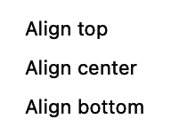
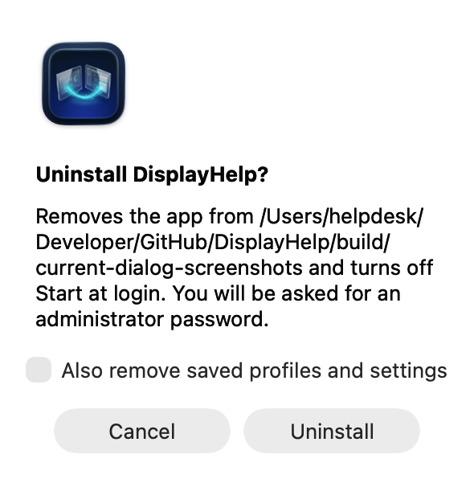
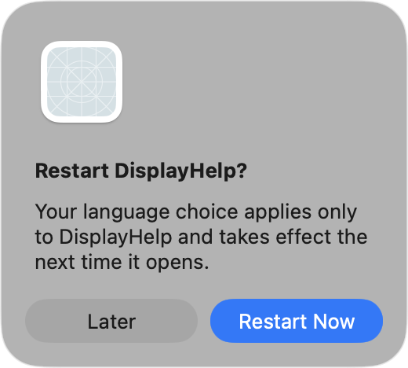

# DisplayHelp user guide

For **DisplayHelp 0.6.6 (120)**. Feedback and suggestions are welcome.

Control by control. The [README](../README.md) is the short version; this is the complete one.

## Contents

1. [Opening the app](#opening-the-app)
2. [The menu bar icon](#the-menu-bar-icon)
3. [Identify Displays](#identify-displays)
4. [Profile row](#profile-row)
5. [Keep or revert display changes](#keep-or-revert-display-changes)
6. [Detect Displays](#detect-displays)
7. [Display cards](#display-cards)
8. [When something is refused](#when-something-is-refused)
9. [Fixes](#fixes)
10. [Recent Events](#recent-events)
11. [Start at Login, Quit, About](#start-at-login-quit-about)
12. [The connect dialog](#the-connect-dialog)
13. [What is remembered, and when it is applied](#what-is-remembered-and-when-it-is-applied)
14. [Keyboard and accessibility](#keyboard-and-accessibility)
15. [Language](#language)

---

## Opening the app

In 0.6.6, the menu fits its content up to 900 points tall, limited by the available screen height. Scroll inside it for any controls below the visible area.

DisplayHelp has no Dock icon or main window. Profile previews, import/export and confirmations use dialogs.
Click its menu bar icon to open the menu;
click anywhere else or press Escape to close it. If the icon is missing, macOS may have hidden it to make room for
app menus on a narrow screen, or the app is not running: open it from `/Applications`.

## The menu bar icon

The icon reports the display state without opening the menu:

| Icon | Meaning |
|---|---|
| Two stacked rectangles | At least one display is mirrored |
| Two displays side by side | More than one display, extended |
| One display | Only the built-in panel is connected |

## Identify Displays

<p align="center">
  <a href="images/identify-displays.png"></a>
</p>

**Identify Displays:** When an external display is connected, use the button beneath Screen Layout to show matching numbers and names on each desktop for five seconds. Mirrored screens share the same numbered group. Labels let clicks pass through and disappear automatically, or when the display configuration changes. This does not change display settings.

## Profile row

<p align="center">
  <a href="images/layout-profiles.png"></a>
</p>

The diagram shows screen geometry, names and rotation; it does not stream desktop content. All screenshots
below show the current 0.6.6 interface with isolated sample data. See [screenshot provenance](README.md#screenshots).

<p align="center">
  <a href="images/profiles.png"></a>
</p>

**Profile: ‹name›** or **Profile: Choose or Create…** at the top left. A profile is a named snapshot of every
connected display: arrangement, size, refresh rate, readable brightness, contrast and monitor volume, rotation, underscan,
mirror leadership, position, main display and audio preference. It also captures the active system audio output when saved as **Full setup**.

The save form offers **Full setup** or **Layout only**. Layout-only profiles save resolution and refresh rate,
rotation, position, the main display and exact mirror groups. They leave brightness, contrast, monitor volume,
underscan, reconnect audio preferences and the active audio output alone. Each display can have a different
resolution in Extend mode. Save two layouts under different names to switch between your two templates.
Overwriting or updating an existing profile preserves its scope; saving its name through the save form uses
the scope selected there.

| Menu item | What it does |
|---|---|
| A profile name | Opens a current → saved preview. Apply restores every connected display it covers. Displays outside the profile receive no saved settings, though macOS may reposition them when the main display changes. Updates verified per-display reconnect presets after you keep the changes. Choose it again after reconnecting to restore the whole layout and system audio output. |
| **Overwrite with Current Settings ›** | Replaces any profile with what is on screen now. |
| **Remove ›** | Deletes one profile. |
| **Update "‹name›" with Current Settings** | Overwrites the profile you last applied or saved with what is on screen now. Appears once you have used one this session. |
| **Load Automatically When Connected ›** | Opt in per profile, uncheck to disable, or choose **Turn Off All Automatic Profiles**. Exact, unambiguous display-set matches load at connection or launch, without a confirmation dialog. |
| **Export… ›** | Export one or all profiles as JSON. |
| **Import Profiles…** | Validate and import JSON, mapping missing display/audio identities to this Mac if needed. Existing names are preserved with numbered suffixes. Imports start with automatic loading off and no favorite assignments. |
| **Save Current Setup As…** | Opens a name field. Choose Full setup or Layout only, type the room or purpose, and press Return or Save. Typing an existing name replaces it. |

**Quick Switch Profiles** contains two global favorite slots. They stay assigned when you change the active profile, so you can switch back to another setup. A favorite does not indicate which profile is currently applied; the **Profile** row shows that.

**Set a favorite in 0.6.6:**

1. Expand **Quick Switch Profiles** beneath Profile to find **Favorite 1 (⌘⌥1)**. The app remembers whether this section is expanded.
2. Click **Choose Profile…** and select the saved profile you want. This only assigns the slot; it does not apply any display settings.
3. Repeat in the **Favorite 2 (⌘⌥2)** row for your second profile.
4. Click **Preview** beside a slot when you want to use it. Review, Apply, then Keep Changes.

No saved profiles yet? Choose **Save Current Setup As…** from the slot menu, save your setup, then select the saved name in the favorite row. To change a favorite, click its assigned name and choose another profile. **Remove Favorite** clears the slot without deleting the profile. Assigning a profile already in the other slot moves it to the selected slot.

Press and release **⌘⌥1** / **⌘⌥2** from any app while DisplayHelp is running to open the same preview.
Only assigned favorites reserve a global shortcut. If registration fails, an explanation appears beneath that slot;
use **Preview** or the local shortcut while DisplayHelp is active. Version 0.6.5 uses the nested
**Profile → Favorite Shortcuts** menu and supports app-local shortcuts only.

The title shows a profile only when every saved setting matches actual readings and the connected display set
matches. Levels, rotation, underscan, position, main display, actual mirror leadership and audio are checked too.
Layout-only matching ignores picture levels and audio. An unreadable saved value cannot be verified and does not count as a match. Status refreshes every five seconds
while the menu is open. Applying or restoring a setup shows a progress message; routine checks do not replace the profile label.

Saving waits for pending slider and rotation changes before reading settings. Restoring temporarily disables display
controls, applies settings in order, then reads them back. The preview identifies disconnected displays; Apply to Connected Displays restores the identifiable subset.
An unavailable saved mirror primary prevents reproducing that mirror group. A failed application or verification
triggers an attempt to restore the previous setup, with remaining mismatches reported. Displays with ambiguous identities are skipped safely.

New profiles record the exact primary of each mirror group, including external-only mirror groups with an
extended laptop. Older profiles remain readable and use their saved Laptop Leads Mirror preference. Update them to capture positions, the main display and system audio output; those
fields were absent from older saves. A saved mirror follower mode can only be restored if macOS offers it under the
saved primary. Incompatible old mirror settings are reported instead of silently replaced by recommendations.

<p align="center">
  <a href="images/restore-preview.png"></a>
</p>

Manual restores show before/after values first in a compact dialog. Its content grows only as needed,
up to a 220-point scrollable area, so short previews do not leave a large empty panel. Missing or ambiguous displays are skipped; unavailable modes and
missing audio devices are identified. Cancel makes no display changes. If the connected display set changes while
the preview is open, open a fresh preview before applying. The Apply button is disabled when no saved display can
be identified. Mode availability can change after rotation or mirroring, so preview warnings are advisory.

Automatic loading is opt-in and bypasses the preview. It waits one second for a matching connection set to settle,
requires exactly one enabled match, and does not retry repeatedly after failure or after manual mode changes.
Enabling it takes effect on the next connection or app launch. Selecting another profile for the same saved set
disables the previous choice. Disable its checkbox to stop automatic loading.

To move a setup to another Mac, export it, then import on the destination. Map the old built-in panel to the new
built-in panel and map any missing external displays/audio devices. Keep a saved identity if that device will be
connected later. Audio mapping updates both the profile's active output and its reconnect preferences. Import
rejects two displays mapped to one device; it never applies settings immediately.

**When to use profiles.** Whenever the same displays are used in more than one way, or the laptop visits more than
one room. One profile per room is the common pattern. A single display you only ever mirror does not need one: the
app already remembers its settings.

### Previous and Default Setup (0.6.6)

The restore buttons below **Quick Switch Profiles** stay visible even when that section is collapsed. They give you two ways back after keeping a profile change:

| Action | Result |
|---|---|
| **Restore Previous Setup** | Previews the setup from before the last successful profile switch. It becomes available after a switch is kept, or an automatic profile restore succeeds. |
| **Save Current Setup as Default…** | Reads and saves the current setup as a full snapshot after you confirm Save. Replaces any earlier default; it does not change your monitors. |
| **Restore Default Setup** | Previews the starting setup you explicitly saved. Disabled until a default has been saved. |

To set your starting point:

1. Arrange the displays and choose the resolutions and other settings you want to return to.
2. Expand **Quick Switch Profiles**, click **Save Current Setup as Default…** beneath the favorite slots, then confirm **Save**.
3. Switch profiles as needed. Your default stays unchanged.
4. To return, click **Restore Default Setup**, review the preview, choose **Apply**, then **Keep Changes**.

**Previous** keeps one undo snapshot, not a history. It follows the scope of the profile switch: undoing a
Layout only switch leaves picture controls and audio alone. A failed, reverted, or ineffective switch does not
replace it, and ordinary manual adjustments do not replace it. Keeping a Previous or Default restore counts
as another profile switch, so Previous then points to the setup you just left. Both snapshots survive quitting
and reopening DisplayHelp. If saving the undo snapshot fails, the switch is rolled back and an error is shown.

**Default** is your chosen starting point, not macOS factory settings. The app cannot reconstruct a first-connection
setup from before this feature was available; arrange and save the setup you want. It captures the same readable
settings as a Full setup profile, not system Output Volume or mute. It changes only when you confirm saving a new default.

Both restore actions use the existing preview and 20-second Keep/Revert flow. Missing displays, unsupported modes
and identical-monitor limits still apply; review any partial restore before applying. These two snapshots are
stored separately from named profiles, are not included in profile export/import, and are cleared (with a backup)
by **Reset All DisplayHelp Data**. Removing a named profile or favorite does not delete them.

### Identical monitors: limits and workaround (0.6.6)

Two monitors can report the same manufacturer, model and serial information. DisplayHelp can save separate
profile settings for them only when macOS supplies distinct display UUIDs. These identify the connections;
they do not guarantee which physical monitor is attached after cables or ports are swapped.

| Limit | What to do |
|---|---|
| These profiles cannot load automatically. | Open the profile or use its favorite shortcut, review the numbered screens, then Apply. |
| Swapping cables, ports or docks can invalidate the saved matching. | Recreate the intended setup and overwrite each affected profile using the steps below. |
| macOS supplies missing or identical UUIDs. | Saving stays blocked; use macOS **System Settings → Displays** to arrange the monitors. There is no manual identity-assignment feature yet. |
| Separate nicknames and reconnect preferences are unavailable while hardware identities are shared. | Use **Identify Displays** and restore the whole saved profile manually. Renaming does not resolve identity ambiguity. |
| DDC controls remain unavailable when the hardware match is ambiguous. | Use the monitor's own controls for brightness, contrast or monitor volume. |

After changing cables, ports or docks:

1. Connect all monitors intended for the profile. Do not apply the old profile yet.
2. Choose **Identify Displays** and check the numbers on the physical screens. Labels last five seconds;
   repeat as needed. Mirrored screens share a group label; use Extend when you need independent desktops.
3. Recreate the intended resolutions and arrangement. Use DisplayHelp's controls when available, or macOS
   **System Settings → Displays** if ambiguous identities prevent a reversible change.
4. Choose **Profile → Overwrite with Current Settings → ‹profile name›**. This replaces that profile's saved
   settings and matching with the current setup, preserving its scope and favorite slot. If saving is still
   blocked, use macOS Displays; re-saving cannot create a missing identity.
5. For a second template, first recreate its intended settings, then overwrite that profile too. Do not
   overwrite both profiles from the same setup unless you want them to become identical.
6. Preview the updated profile and check its numbered screens. After applying a change, choose **Keep Changes**
   only when every screen is correct; otherwise choose **Revert** or let the 20-second timer expire.

If a display remains missing or ambiguous, use **Troubleshooting → Copy Diagnostics** and share the report
with your helpdesk. Resetting app data is not a fix for identical hardware identities.

## Keep or revert display changes

<p align="center">
  <a href="images/keep-changes.png"></a>
</p>

Manual layout changes, resolution/refresh changes, rotation, underscan, Detect Displays and profile applications
capture the previous setup before changing hardware. The current resolution of every connected screen must be
readable before a reversible change can begin. After a successful change, **Keep Changes** and **Revert**
appear with a **20-second** countdown. Keep confirms the observed setup before saving reconnect preferences;
Revert or an expired countdown attempts to restore the previous setup. Sleep does not extend the deadline.
A display connection change during confirmation also triggers recovery.

The confirmation has its own floating window, so closing the menu does not dismiss it. Display controls are
unavailable while an operation or confirmation is in progress. Automatic profiles bypass the preview and timed
confirmation, but still verify the result and attempt rollback on failure. Brightness, contrast, monitor-volume
and audio choices do not use the timed layout confirmation.

Recovery depends on connected hardware and available modes. If some previous settings cannot be restored,
use **Open Display Settings** and the reported details. Rejected changes do not replace working reconnect
preferences. If a profile file cannot load, **Recover Profiles from Backup** is offered when a valid backup exists;
**Archive Unreadable File and Start Fresh…** preserves the original before creating an empty library.
See [data-files.md](data-files.md#profile-file-recovery) for backup details.

## Detect Displays

Open **Troubleshooting → Detect Displays**. One click:

1. Rescans all displays.
2. If the built-in panel is on a pixel-exact mode with a tiny UI, puts it back on its saved or default Retina mode.
3. For each external display, if the wrong side is leading the mirror set, re-mirrors it the right way round.
4. Applies **Match Laptop** to mirrored externals and **Best for Display** to extended ones.

Changes use the same Keep Changes / Revert confirmation. Settings that already match are left alone. If only the built-in panel is found, it says
so under the cards: check the cable and the projector's input.

## Display cards

One card per connected display, in the order reported by macOS.

<p align="center">
  <a href="images/menu.png"></a>
</p>

The capture uses sample displays to show the current controls. Each card reports its own mode and refresh
rate. An orange dot indicates a different recommended mode or a low refresh rate. Controls depend on the
capabilities and readings available on your connection. Placement and rotation readouts stay visible; Place… appears when another screen is connected and this screen is extended. Expand **More Controls** for refresh rate, recommendations, Audio, supported external rotation, contrast, Monitor Volume and underscan. The sample values are not a promise of hardware support.

### Header
- **Symbol.** Laptop for the built-in panel, TV when EDID detailed timings include a 4K-class size, monitor
  otherwise. A 4K TV can show the monitor symbol if its EDID timings are unavailable.
- **Name.** The EDID name, or the name you gave it.
- **Status line.** "Mirrored · 1920×1080 HiDPI · 60 Hz". The first part is one of **Mirrored**, **Extended**,
  **Extended, main** (the display holding the menu bar), or **Only display** when nothing else is connected.
- **Dot.** Green: on a mode DisplayHelp would choose. Orange: not, which means pixel-exact 4K, a size the EDID does
  not guarantee, or a refresh rate below 50 Hz. Hover for the reason.
- **Pencil** (externals only). Rename. Type and press Return; Escape cancels. The name is stored against the
  display's vendor/model/serial identity in this user’s local store. Renaming does not transfer settings to another Mac
  or distinguish devices that report the same identity.
- **ⓘ** opens a details popover: vendor, model, serial, native size, EDID-guaranteed sizes, the current mode, what
  each recommendation would pick, and the identity key. Its **Supported Resolutions** list is every mode macOS
  offers, one line per size with its refresh rates, including the ones the picker hides.

### Arrangement (externals)

<p align="center">
  <a href="images/extend.png"></a>
</p>

**Mirror** and **Extend**. The current one is greyed. The choice is remembered and applied at every reconnect.
Hidden on the built-in panel, which has no arrangement of its own.

### Resolution

<p align="center">
  <a href="images/resolution.png"></a>
</p>

One entry per size and scaling, at its best refresh rate. "HiDPI" means the display renders at double resolution
and draws the UI at half, which is what you want on a 4K TV. Only sizes from the display's EDID detailed timings
are listed, because TVs advertise sizes they cannot render. The current size is always listed even if it is not one
of them, so the picker never goes blank. If no EDID detailed timings are readable, the app uses the usable modes
reported by macOS without that additional filter.

### Refresh Rate

<p align="center">
  <a href="images/refresh-rate.png"></a>
</p>

Under **More Controls** when the current size offers more than one rate. Fastest first.

| Rate | When |
|---|---|
| 60 Hz | Default. Smooth mouse and motion. |
| 50 Hz | PAL video content, or a display that only syncs cleanly at 50. |
| 30 Hz | A long or cheap HDMI cable that cannot hold 4K at 60. Motion feels heavier but the link holds. |
| 24 Hz | Film playback without judder. Not for working. |

Recommendations prefer 50 Hz or better. If no filtered mode reaches 50 Hz, Best for Display falls back to
the available filtered modes. The orange dot can remain even when no faster recommendation is available.
The Resolution picker labels each size with its highest offered rate; the status line and Refresh Rate control
show the rate actually in use.

### Match Laptop / Best for Display (externals)
- **Match Laptop.** The laptop's logical size on the external, so mirrored text is not rescaled. If the display
  cannot render that size, the closest guaranteed size at or above it, preferring the HiDPI variant.
- **Best for Display.** The display's native resolution at its best refresh, drawn HiDPI when a HiDPI variant
  exists. On a 4K TV that is 1920×1080 HiDPI, not 3840×2160.

Both grey out when the display is already on the mode they would choose. They also run automatically: change the
laptop's size while mirrored and the external re-matches; if it cannot, the laptop snaps to the external's size.

### Laptop Leads Mirror (externals)
Which display's shape wins in a mirror set.

| Setting | Laptop screen | External screen | Use when |
|---|---|---|---|
| Off (default) | Band top and bottom on a 16:10 panel | Full, one shared size | The audience screen matters most |
| On | Full-screen | Bars on the sides | You work on the laptop; the audience screen is secondary |

Remembered per display and re-applied on every reconnect. Ignored when the lid is closed and there is no laptop
panel to lead.

### Audio (externals)

<p align="center">
  <a href="images/audio.png"></a>
</p>

Under **More Controls → Audio**. Choosing an output switches sound now and remembers which output device plays the Mac's sound whenever this display is connected. The list is every output the Mac has
right now, with the display's own HDMI or DisplayPort audio first and marked "(this display)":

| Choice | Room it fits |
|---|---|
| Don't change (default) | Nothing is switched. A call never jumps to a TV because someone plugged in to charge. |
| ‹TV› (this display) | Sound over the same HDMI cable, the common case. |
| External Headphones | Rooms that take audio on a separate 3.5 mm run to the amp. Appears when the cable is plugged in. |
| A USB dock or wall plate | Rooms whose USB-C connection carries audio. |
| An AirPlay receiver, or Crestron AirMedia / Solstice / ClickShare driver | Wireless rooms. Those senders install their own output device; pick it here. |

Remembered per display and included in full-setup profiles, so "Room 204" can mean video over HDMI and sound over the
3.5 mm cable. A saved choice whose device is absent right now is listed as "‹name› (not connected)" so the selection
stays visible; at connect, sound stays where it is and the log says so. Choosing
"Don't change" while the previous choice is playing sends sound back to the Mac's speakers. macOS itself falls back
to the internal speakers when the display is unplugged. This picks which device plays; a TV's own volume stays on
its remote.

### Output Volume

<p align="center">
  <a href="images/output-volume.png"></a>
</p>

The separate **Output Volume** section beneath Screen Layout follows the Mac’s active audio output. Choose the built-in speakers in macOS Sound or the display’s Audio picker to control the Mac’s speaker volume here. Changes made in Control Center, with the volume keys, or by connecting another audio device update the control automatically.

Adjust the slider or use **Mute / Unmute** when supported. Outputs that do not expose adjustable volume to macOS (often HDMI) show an explanation instead of a slider. Use the monitor’s own controls or **Monitor Volume** if DDC is available. Output Volume and mute are live system controls; they are not saved in display profiles. The existing profile volume setting controls the external monitor’s DDC volume.

<p align="center">
  <a href="images/output-volume-unavailable.png"></a>
</p>

### Rotation (externals)

<p align="center">
  <a href="images/rotation.png"></a>
</p>

The current angle is shown beside Place…. Change it under **More Controls → Rotation**: 0°, 90°, 180°, 270°. The picker appears for external displays that report supported rotation. Remembered after confirmation.

### Brightness, Contrast, Monitor Volume
The built-in panel shows Brightness when macOS returns a readable value. External displays get the sliders their hardware answers to over DDC/CI.
On Apple Silicon, USB-C and DisplayPort can carry DDC, but support varies by monitor and adapter. HDMI and
some TVs may not expose usable DDC controls.
An absent slider means there is no usable reading, not necessarily that the monitor can never support it.
The card’s unavailable-control explanations describe known limitations without guessing the cause. DDC is not
implemented on Intel Macs, and ambiguous hardware matches disable DDC to avoid changing the wrong monitor.
Values are remembered per display after readback verification.

### Underscan (externals)
A slider that shrinks the picture for projectors that crop the edges. Shown when the display supports it. Remembered.

### Position (extend mode only)

<p align="center">
  <a href="images/position.png"></a>
</p>

<p align="center">
  <a href="images/position-alignment.png"></a>
</p>

- **Place… → Make [display name] Main** selects that display as the main screen. Choose **Keep Changes** to retain it. To save this choice, create a profile or use **Profile → Overwrite with Current Settings → [profile name]**. Both Full setup and Layout only profiles include the main display; existing profiles are not updated automatically.
- **Place… → Relative to [other display] → Place [selected display] left/right/above/below [other display] → Align [edge or center]** arranges the desktop. Left/right placement offers
  top, center or bottom alignment; above/below offers left, center or right alignment.

The numbered layout preview above the cards shows screen geometry, the main display and rotation. Use it to
check layouts with different screen sizes; placement is controlled by the menus rather than dragging the preview.

The placement and rotation readouts show the actual setup without opening a menu. For example, **Left of Built-in Display · Top aligned** on an external card means that external is left of the laptop. Using Left on the built-in card instead places the laptop left of the external. Nonstandard geometry shows **Custom position**.

Place… is hidden while mirrored or when only one display is connected. The readout shows **Mirrored desktop** or **Only display** and still reports rotation.

## When something is refused

If macOS refuses a change, a red line appears under the display cards saying what was asked and the error, for
example "Couldn't set 1920×1080 on SAMSUNG: display configuration failed (CGError 1001)". Next to it, **Open
Display Settings** opens macOS's own Displays pane for the rare cases the app cannot handle. The line clears on the
next successful action, and the same failure is recorded in Recent Events as `applyFailed`.

## Fixes

Expand **Troubleshooting** for these actions, Detect Displays, Recent Events and Copy Diagnostics.

### Reset Display Preferences 🔒
Deletes `/Library/Preferences/com.apple.windowserver*`, `/private/var/db/WindowServer`, every user's
`ByHost/com.apple.windowserver.displays*`, then restarts WindowServer. ColorSync profile files are preserved. **Everyone is
logged out immediately.** Use it for a Mac whose displays keep coming up wrong no matter what is picked. macOS
rebuilds the database on the next login. Needs an administrator password, asked for by macOS's own dialog.
ColorSync preservation requires 0.5.2 or later; older installers can remove display-profile folders.

<p align="center">
  <a href="images/reset-confirmation.png"></a>
</p>

### Custom Fixes
Buttons the helpdesk adds by dropping scripts into:

```
~/Library/Application Support/DisplayHelp/scripts/
```

This is a local folder, not an upload service. Each script is a plain-text zsh file ending in `.sh`, with
metadata comments within its first 20 lines. The app scans the folder every time the menu opens.
The [custom-fix examples](../examples/custom-fixes/README.txt) include installation steps, a harmless demo and
an optional Dock restart. Install as the current user, without `sudo`, and reopen the menu to see the actions.

<p align="center">
  <a href="images/custom-fixes-folder.png"></a>
</p>

The scripts appear under **Custom Fixes** after the menu reopens:

<p align="center">
  <a href="images/custom-fixes-menu.png"></a>
</p>

```zsh
#!/bin/zsh
# name: Demo — Test Custom Fixes
# description: Confirms setup without changing settings.
# admin: false
echo "Demo successful — Custom Fixes is working. No settings were changed."
```

| Header | Effect |
|---|---|
| `name` | The button label. Any number of scripts, listed alphabetically by name. |
| `description` | Tooltip and confirmation text. |
| `admin` | `true` adds the lock symbol and runs the script as root through the macOS administrator dialog. `false` runs it as the logged-in user. |

Clicking a button confirms, runs the script, and shows "exit ‹code›, ‹seconds›s. ‹last line of output›" under
Fixes. A non-zero exit shows the same way so a failure is visible.
Run the demo first: an `exit 0` result and the success message confirm installation. Remove a custom action by
moving its script out of the folder and reopening the menu. Scripts run without an interactive Terminal;
they must not wait for typed input. Administrator scripts run as root and must explicitly target the intended user.

<p align="center">
  <a href="images/custom-fixes-confirmation.png"></a>
</p>

<p align="center">
  <a href="images/custom-fixes-success.png"></a>
</p>

**Safety rules, enforced.** A script is ignored, with the reason in the log, when it is not owned by the current
user, is world-writable, or is a symbolic link. For fleet deployment, MDM can push approved scripts into each user's
folder as long as the files end up owned by that user with mode 0755.

### More › Uninstall DisplayHelp… 🔒

<p align="center">
  <a href="images/uninstall-confirmation.png"></a>
</p>

Confirms with an "Also remove saved profiles and settings" checkbox, turns off Start at Login, then an administrator
script removes the app bundle and the package receipt, and the app quits. If anything fails the app stays open and
says why. IT can run the same script without the dialog:

```
sudo /bin/zsh /Applications/DisplayHelp.app/Contents/Resources/DisplayHelp_DisplayHelp.bundle/Contents/Resources/Resources/Uninstall/uninstall.sh \
    /Applications/DisplayHelp.app purge /Users/<name>
```

`keep` in place of `purge` leaves the user's data. The script refuses any path that is not `DisplayHelp.app`.


### Clear history, forget a display, or start fresh

<p align="center">
  <a href="images/data-actions.png"></a>
</p>


These are separate actions:

| Action | Removes | Keeps |
|---|---|---|
| **Troubleshooting → Recent Events → Clear Connection History** | Current event log, moved into an archive | Remembered monitor preferences, profiles and favorites |
| **Display options (…) → Forget This Display…** | That external monitor's remembered name and reconnect preferences | Current screen settings, profiles/favorites and connection history |
| **Troubleshooting → More → Reset All DisplayHelp Data…** | All active remembered monitors, profiles/favorites, automatic choices and history | Current hardware settings, custom fixes and Start at Login |

Automatic profiles are **opt-in**. Under **Profile → Load Automatically When Connected**, uncheck individual
profiles or choose **Turn Off All Automatic Profiles**. Manual profile use and favorites still work. Forgetting a
monitor does not edit profiles: if an enabled automatic profile includes it, that profile can restore settings
at the next connection or launch. The Forget confirmation warns about this. Disable automatic loading if you
want DisplayHelp to ask how to use the monitor again on reconnect.

The full reset requires **Back Up and Reset** confirmation. Previous data, including history archives, is saved
beside the new folder as `~/Library/Application Support/DisplayHelp-backup-<UUID>/`.
**Show Data Backup in Finder** reveals it afterward. The backup retains the old information; reset is not secure
erasure. Separately exported profiles are unaffected. To restore a backup, quit DisplayHelp, move the new
`DisplayHelp` folder aside, then rename the backup to `DisplayHelp` in the same parent folder.

Reset/Forget are unavailable during queued display operations or a pending Keep/Revert decision; full reset also
waits for running custom fixes. A staging failure preserves the original data. Neither action changes the current
resolution, arrangement, rotation, picture levels or audio. **Reset Display Preferences** is a different command
that resets macOS display configuration.

## Recent Events

<p align="center">
  <a href="images/recent-events.png"></a>
</p>

**Copy Diagnostics** copies app/macOS versions, display identities, modes, layout, available-control explanations
and up to 20 recent events to the clipboard. Placement and rotation traces link requests, observed results, verification and Keep/Revert outcomes by a change ID. Nothing is uploaded; review the report before sharing it.

Under **Troubleshooting → Recent Events**, collapsed by default. The latest 20 events from the history file, newest first, as
`time  kind  display  (detail)`. See [data-files.md](data-files.md#history-event-kinds) for the vocabulary.
**Clear Connection History** archives the list to a dated file. **Show History File** opens the folder in Finder.

## Start at Login, Quit, About

<p align="center">
  <a href="images/about.png"></a>
</p>

**Start at Login** is on by default after a packaged install. Off means the app must be opened from Applications.
Greyed when running unbundled from `swift run`. Normally **Quit DisplayHelp** leaves the confirmed setup in place.
Quit is disabled while changes are in progress. A system quit request during confirmation first attempts to revert;
if recovery fails, the app stays open so you can finish recovery. The **Ayala Solutions · v‹version›** link opens the About panel.

## The connect dialog

<p align="center">
  <a href="images/first-connect.png"></a>
</p>

Appears when a display the app has never seen, or one set to "ask", is connected.

- **Mirror**: same picture on both. Remembered.
- **Extend**: second desktop. Remembered.
- **Not now**: leaves macOS's default and asks again next time.

If the display has no saved preferred mode, the app also applies a recommendation right after: Match Laptop when
mirroring, Best for Display when extending.

## What is remembered, and when it is applied

| Setting | Remembered | Applied |
|---|---|---|
| Arrangement | Per display | At every connect |
| Preferred mode (size, refresh, scaling) | Per display, whenever you change it or apply a profile | At launch, at connect, and once per connection if macOS drifts it |
| Brightness, contrast, volume | Per display | At connect |
| Rotation, underscan | Per display | At connect |
| Laptop Leads Mirror | Per display | Whenever mirroring is applied |
| Name | Per display | Always |
| Audio preference | Per external display | When selected and at connect, if the output is available |
| Profiles | Whole setup, by name | After preview and Apply; at connection or launch when automatic loading is enabled for an exact, unambiguous display set |

A mirror follower's size is never set directly: the primary dictates it. The built-in panel's saved mode can be
restored when extended or when it leads the mirror set. Automatic restoration still avoids pixel-exact Retina
modes; explicitly loading a profile attempts the exact saved mode and verifies the result.

## Keyboard and accessibility

- **⌘⌥1** and **⌘⌥2** preview assigned favorites while DisplayHelp is active.
- In the confirmation window, Return keeps changes and Escape reverts.
- Every control has a name for VoiceOver, including the sliders (with their percentage), the pencil and the ⓘ.
- Tab moves through the controls in reading order; Escape closes the menu and cancels a rename or profile name.
- Colour never carries meaning alone: the green/orange dot has a spoken label and a tooltip.
- The menu respects the system's text size, light and dark appearance, and increased contrast.

## Language

**New in 0.6.5: ten additional languages, for eleven supported languages including English.**

| Language | Name shown in the globe menu |
|---|---|
| English | English |
| German | Deutsch |
| Spanish | Español |
| French | Français |
| Italian | Italiano |
| Japanese | 日本語 |
| Korean | 한국어 |
| Brazilian Portuguese | Português (Brasil) |
| Simplified Chinese | 简体中文 |
| Traditional Chinese | 繁體中文 |
| Arabic | العربية |

### Follow your Mac's language

DisplayHelp follows macOS language preferences by default. If you previously chose an app language, open DisplayHelp, click the **globe** at the top, choose **Follow System**, then **Restart Now**. macOS selects the best available bundled translation from your preferred languages; English is the final fallback.

For example, a Mac set to Italian uses Italian when DisplayHelp follows the system. An unsupported first language can fall back to another supported language in your preferred list.

### Choose a language inside DisplayHelp

1. Click the DisplayHelp icon in the macOS menu bar.
2. Click the **globe** at the top of the app menu.
3. Select your language by its native name.
4. Choose **Restart Now**, or **Later** to apply the choice the next time the app opens.

This changes only DisplayHelp for the current macOS user. For example, you can use DisplayHelp in Spanish on an English-language shared Mac without changing the Mac's language or other apps. The selection persists until changed; choose **Follow System** to return to the Mac's preferences. The globe is temporarily unavailable while display changes, profile checks or fixes are running.

### macOS settings versus the in-app globe

| Where you choose | What it does |
|---|---|
| **System Settings → General → Language & Region → Preferred Languages** | Sets the Mac's language preferences, which DisplayHelp follows when it has no app-specific override. |
| **System Settings → General → Language & Region → Applications → DisplayHelp** | Sets a language specifically for DisplayHelp. Relaunch the app to apply it. |
| **DisplayHelp → globe → a language** | Sets the same native per-app language preference from inside the app, with a restart prompt. |
| **DisplayHelp → globe → Follow System** | Removes the app-specific override so macOS chooses from your preferred languages again. |

**Both routes use Apple's native localization system and the same bundled translations.** The globe is a convenient selector, not a separate translation engine. An app-specific choice takes precedence over the Mac's preferred languages until removed. No online translation service is used, and macOS does not generate missing translations.

Language is separate from display profiles: loading or importing a profile does not change it. User-entered profile/display names, device names, custom script descriptions/output and historical diagnostics keep their original text. Longer interface labels wrap or stack; Arabic uses right-to-left presentation while the display diagram preserves physical screen positions.

<p align="center">
  <a href="images/language-menu.png"></a>
</p>

<p align="center">
  <a href="images/language-confirmation.png"></a>
</p>

See the [localized screenshot examples](README.md#screenshots) for Traditional Chinese and Arabic. Translation terminology has been checked against Apple documentation; independent native-speaker review remains pending.


## Does this release check HDCP or test cables?

No. DisplayHelp 0.6.6 does not include HDCP status checks, HDCP negotiation changes or link-error/cable tests. Research probes are separate from the app. Copy Diagnostics remains useful for display identity, settings and recent changes, but does not certify protected playback or cable health.
